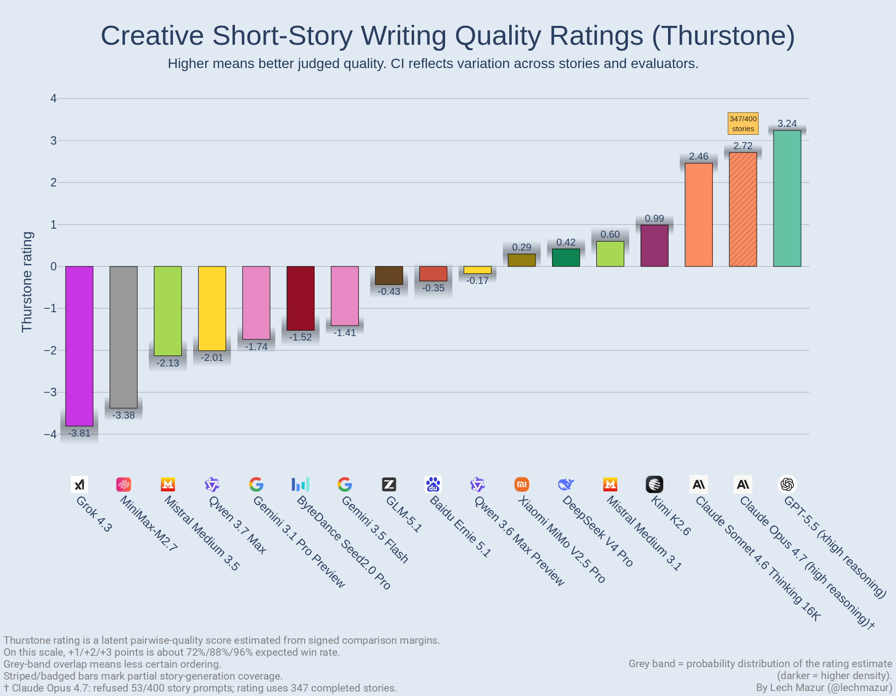
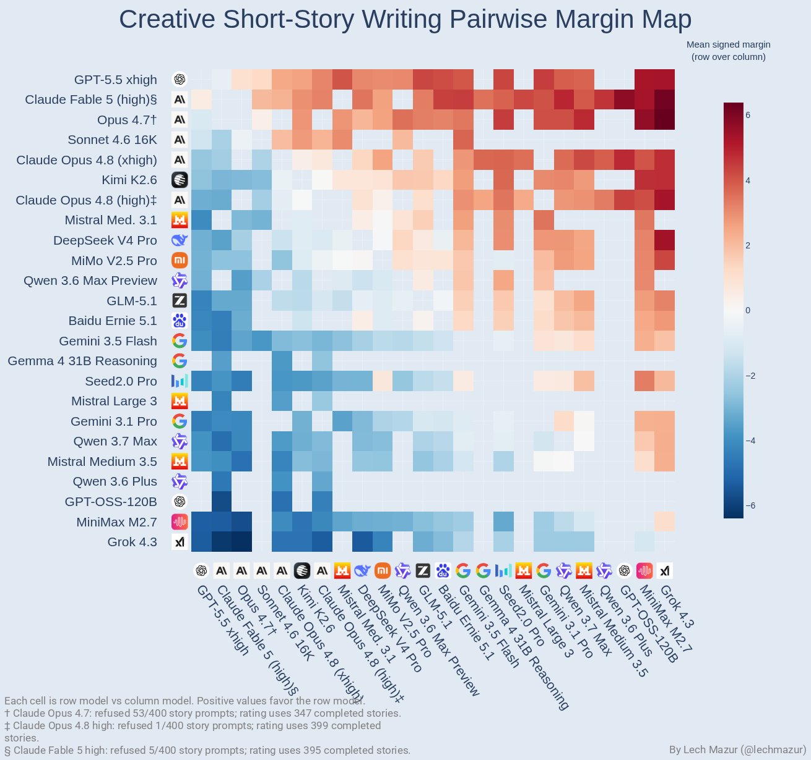

# LLM Creative Story-Writing Benchmark

This benchmark measures short-fiction writing with **head-to-head story comparisons**. Models write stories to the same constrained creative briefs, and evaluator LLMs compare pairs of stories written for the same required elements. Those pairwise judgments are aggregated into a global comparison score.

Higher scores mean a model more often wins direct story comparisons against the rest of the pool. The exact score scale is relative to this comparison graph, so differences and confidence intervals matter more than the absolute number.

---

## Current Results

### Leaderboard

Current comparison set:

- 20 rated models
- 132 direct model pairings
- about 14k parsed evaluator judgments
- uncertainty resampled across both stories and evaluators
- side-position bias correction enabled
- `†`, striped bars, and story-count badges mark model-specific story-generation coverage caveats

| Rank | Model | Comparison Score | Win Prob vs Pool | 95% CI |
|-----:|:------|-----------------:|-----------------:|:-------|
| 1 | GPT-5.5 (extra-high reasoning) | 3.0 | 0.89 | 2.9..3.1 |
| 2 | GPT-5.4 (extra-high reasoning) | 2.8 | 0.88 | 2.7..3.0 |
| 3 | GPT-5.4 (medium reasoning) | 2.7 | 0.87 | 2.5..2.9 |
| 4 | Claude Opus 4.7 (high reasoning)† | 2.4 | 0.83 | 2.2..2.6 |
| 5 | Claude Sonnet 4.6 Thinking 16K | 2.1 | 0.80 | 1.9..2.3 |
| 6 | Claude Opus 4.6 Thinking 16K | 1.7 | 0.74 | 1.4..1.9 |
| 7 | GPT-5.2 (medium reasoning) | 0.9 | 0.64 | 0.7..1.1 |
| 8 | Kimi K2.6 | 0.5 | 0.58 | 0.3..0.7 |
| 9 | Mistral Medium 3.1 | 0.0 | 0.50 | -0.2..0.3 |
| 10 | DeepSeek V4 Pro | -0.1 | 0.48 | -0.3..0.1 |
| 11 | Xiaomi MiMo V2.5 Pro | -0.3 | 0.46 | -0.5..-0.1 |
| 12 | Qwen 3 Max Preview | -0.4 | 0.44 | -0.6..-0.2 |
| 13 | Qwen 3.6 Max Preview | -0.7 | 0.39 | -0.9..-0.6 |
| 14 | Kimi K2.5 Thinking | -1.0 | 0.34 | -1.3..-0.8 |
| 15 | Xiaomi MiMo V2 Pro | -1.1 | 0.33 | -1.3..-0.8 |
| 16 | GLM-5.1 | -1.1 | 0.33 | -1.4..-0.9 |
| 17 | ByteDance Seed2.0 Pro | -2.2 | 0.18 | -2.5..-2.0 |
| 18 | Gemini 3.1 Pro Preview | -2.4 | 0.17 | -2.6..-2.2 |
| 19 | DeepSeek V3.2 | -2.8 | 0.12 | -3.1..-2.5 |
| 20 | MiniMax-M2.7 | -4.0 | 0.04 | -4.2..-3.8 |

### Coverage Note

- † Claude Opus 4.7 refused some story-generation prompts in this run. It produced 347 completed stories out of 400 prompts. The comparison score uses completed stories only; no score was imputed for refused prompts.

---

## Pairwise Margin Map

Each cell is the average signed comparison margin for the row model against the column model. Positive values mean the row model tended to beat the column model on stories written to the same required elements.

---

## What Is Measured

Every story must meaningfully incorporate ten required elements:

- character
- object
- concept
- attribute
- action
- method
- setting
- timeframe
- motivation
- tone

The comparison protocol keeps the prompt and required elements matched within each story pair. This makes the judgment about which story better satisfies the same creative brief, rather than which model happened to receive an easier prompt.

Evaluator prompts separate rubric-aligned observations from important beyond-rubric observations, but the public model score is not an average absolute grade. It is the model's position in the pairwise comparison graph.

---

## Method Summary

1. Generate stories in the benchmark format.
2. Build matched story-comparison prompts for models that wrote to the same required elements.
3. Compare both visible story orders to reduce position bias.
4. Parse evaluator responses into winner labels and signed margins.
5. Correct measured side-position bias in signed margins.
6. Average opposite-order judgments before story-level aggregation.
7. Aggregate story-level pair margins into a global comparison score.
8. Bootstrap over stories and evaluators to estimate uncertainty.

The rating chart and pairwise margin map use shared display names, family colors, and model-brand logos where available.

---

## Archived Absolute Ratings

Earlier versions of this benchmark used absolute 0-10 rubric ratings rather than direct story comparisons. Those results remain historical context, but the current public quality ranking should use the pairwise comparison results above.

---

## Recent Updates

- Apr 29, 2026: This comparison refresh expands the evaluated writer pool and comparison coverage, including GPT-5.5 (extra-high reasoning), Kimi K2.6, DeepSeek V4 Pro, Xiaomi MiMo V2.5 Pro, Qwen 3 Max Preview, Gemini 3.1 Pro Preview, ByteDance Seed2.0 Pro, Qwen 3.6 Max Preview, and MiniMax-M2.7. The evaluator panel was also refreshed. Pairwise judgments now use a broader set of current comparator LLMs, including Claude Opus 4.7 (high reasoning), Qwen 3.6 Max Preview, Kimi K2.6, Gemini 3.1 Pro Preview, DeepSeek V4 Pro, GPT-5.5 (medium reasoning), GLM-5.1, and Grok 4.20 0309 (Reasoning).

---

## Related Benchmarks

Multi-agent benchmarks:

- [PACT - Benchmarking LLM negotiation skill in multi-round buyer-seller bargaining](https://github.com/lechmazur/pact)
- [BAZAAR - Evaluating LLMs in Economic Decision-Making within a Competitive Simulated Market](https://github.com/lechmazur/bazaar)
- [Public Goods Game Benchmark: Contribute & Punish](https://github.com/lechmazur/pgg_bench/)
- [Elimination Game: Social Reasoning and Deception Under Pressure](https://github.com/lechmazur/elimination_game/)
- [Step Race: Collaboration vs. Misdirection Under Pressure](https://github.com/lechmazur/step_game/)

Other benchmarks:

- [LLM Round-Trip Translation Benchmark](https://github.com/lechmazur/translation/)
- [Extended NYT Connections](https://github.com/lechmazur/nyt-connections/)
- [LLM Thematic Generalization Benchmark](https://github.com/lechmazur/generalization/)
- [LLM Confabulation/Hallucination Benchmark](https://github.com/lechmazur/confabulations/)
- [LLM Deceptiveness and Gullibility](https://github.com/lechmazur/deception/)
- [LLM Divergent Thinking Creativity Benchmark](https://github.com/lechmazur/divergent/)

Follow [@lechmazur](https://x.com/LechMazur) on X for other benchmarks and updates.
