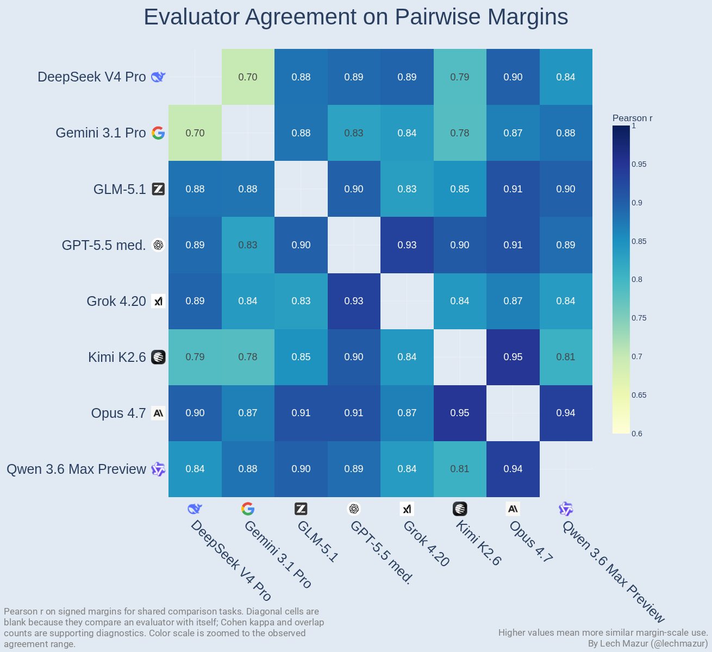
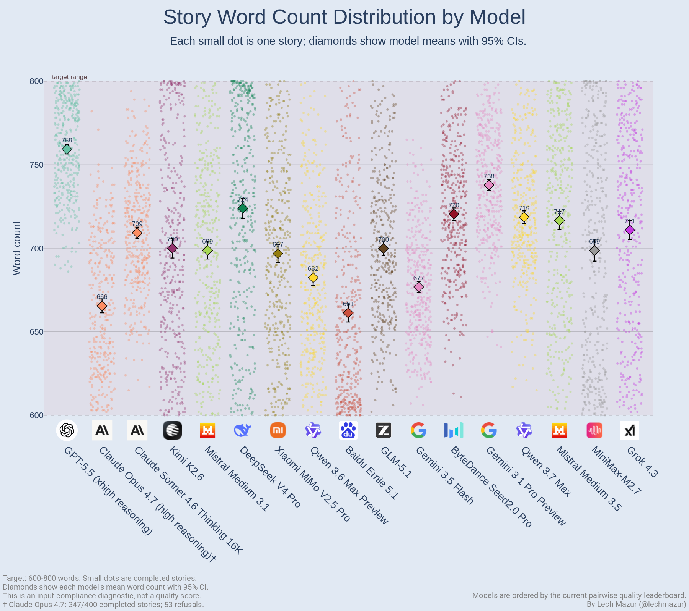

# LLM Creative Story-Writing Benchmark

This benchmark measures short-fiction writing with **head-to-head story comparisons**. Models write stories to the same constrained creative briefs, and evaluator LLMs compare pairs of stories written for the same required elements. Those pairwise judgments are aggregated into a global comparison score.

Higher scores mean a model more often wins direct story comparisons against the rest of the pool. The exact score scale is relative to this comparison graph, so differences and confidence intervals matter more than the absolute number.

---

## Current Results

### Leaderboard

Current comparison set:

- 31 rated models
- 231 direct model pairings
- about 26.1k parsed evaluator judgments
- uncertainty resampled across both stories and evaluators
- side-position bias correction enabled
- the main chart above hides chart-suppressed models for readability; this table includes every rated model
- A dagger or double dagger marks partial story coverage

| Rank | Model | Comparison Score | Win Prob vs Pool | 95% CI |
|-----:|:------|-----------------:|-----------------:|:-------|
| 1 | GPT-5.5 (xhigh reasoning) | 3.5 | 0.92 | 3.4..3.6 |
| 2 | gpt-5.4-xhigh | 3.4 | 0.91 | 3.3..3.6 |
| 3 | gpt-5.4-medium | 3.3 | 0.90 | 3.2..3.5 |
| 4 | Claude Opus 4.7 (high reasoning)† | 3.0 | 0.87 | 2.8..3.1 |
| 5 | Claude Sonnet 4.6 Thinking 16K | 2.8 | 0.86 | 2.7..3.0 |
| 6 | claude-opus-4-6-16K | 2.2 | 0.80 | 2.0..2.5 |
| 7 | Claude Opus 4.8 (xhigh reasoning) | 1.7 | 0.75 | 1.6..1.9 |
| 8 | gpt-5.2-medium | 1.5 | 0.72 | 1.3..1.7 |
| 9 | Kimi K2.6 | 1.2 | 0.68 | 1.1..1.4 |
| 10 | Claude Opus 4.8 (high reasoning)‡ | 1.1 | 0.67 | 1.0..1.3 |
| 11 | Mistral Medium 3.1 | 0.8 | 0.63 | 0.6..1.0 |
| 12 | DeepSeek V4 Pro | 0.6 | 0.60 | 0.5..0.8 |
| 13 | Xiaomi MiMo V2.5 Pro | 0.5 | 0.58 | 0.3..0.6 |
| 14 | qwen3-max-preview | 0.4 | 0.57 | 0.2..0.6 |
| 15 | Qwen 3.6 Max Preview | 0.1 | 0.52 | -0.1..0.2 |
| 16 | Baidu Ernie 5.1 | -0.1 | 0.49 | -0.4..0.1 |
| 17 | GLM-5.1 | -0.2 | 0.48 | -0.4..0.0 |
| 18 | kimi-k2.5 | -0.2 | 0.47 | -0.4..-0.1 |
| 19 | mimo-v2-pro | -0.4 | 0.45 | -0.7..-0.2 |
| 20 | Gemini 3.5 Flash | -1.2 | 0.33 | -1.3..-1.1 |
| 21 | ByteDance Seed2.0 Pro | -1.4 | 0.30 | -1.6..-1.2 |
| 22 | Gemini 3.1 Pro Preview | -1.5 | 0.29 | -1.7..-1.3 |
| 23 | Mistral Large 3 | -1.6 | 0.28 | -1.8..-1.3 |
| 24 | Gemma 4 31B Reasoning | -1.7 | 0.26 | -1.9..-1.5 |
| 25 | Qwen 3.7 Max | -1.8 | 0.25 | -2.0..-1.6 |
| 26 | Mistral Medium 3.5 | -1.9 | 0.23 | -2.1..-1.7 |
| 27 | deepseek-v32 | -2.1 | 0.21 | -2.4..-1.8 |
| 28 | Qwen 3.6 Plus | -2.2 | 0.20 | -2.5..-1.7 |
| 29 | MiniMax-M2.7 | -3.1 | 0.11 | -3.3..-2.9 |
| 30 | GPT-OSS-120B | -3.2 | 0.10 | -3.5..-2.9 |
| 31 | Grok 4.3 | -3.6 | 0.07 | -3.8..-3.4 |

### Coverage Note

- † Claude Opus 4.7 refused some story-generation prompts in this run. It produced 347 completed stories out of 400 prompts. The comparison score uses completed stories only; no score was imputed for refused prompts.
- ‡ Claude Opus 4.8 high refused one story-generation prompt in this run. It produced 399 completed stories out of 400 prompts. The comparison score uses completed stories only; no score was imputed for the refused prompt.

---

## Pairwise Margin Map

Each cell is the average signed comparison margin for the row model against the column model. Positive values mean the row model tended to beat the column model on stories written to the same required elements. Both axes are ordered from best to worst by the current Thurstone leaderboard.

---

## Diagnostics

### Evaluator Agreement

This matrix shows how similarly evaluator models used the signed pairwise-margin scale on shared comparison tasks. Higher Pearson correlation means closer agreement between evaluators.

### Word Count Compliance

This is an input-compliance diagnostic, not a quality ranking. It shows individual completed story lengths, plus model-level mean length and 95% confidence intervals against the 600-800 word target range. Models are sorted alphabetically by display name.

---

## What Is Measured

Every story must meaningfully incorporate ten required elements:

- character
- object
- concept
- attribute
- action
- method
- setting
- timeframe
- motivation
- tone

The comparison protocol keeps the prompt and required elements matched within each story pair. This makes the judgment about which story better satisfies the same creative brief, rather than which model happened to receive an easier prompt.

Evaluator prompts separate rubric-aligned observations from important beyond-rubric observations, but the public model score is not an average absolute grade. It is the model's position in the pairwise comparison graph.

---

## Method Summary

1. Generate stories in the benchmark format.
2. Build matched story-comparison prompts for models that wrote to the same required elements.
3. Compare both visible story orders to reduce position bias.
4. Parse evaluator responses into winner labels and signed margins.
5. Correct measured side-position bias in signed margins.
6. Average opposite-order judgments before story-level aggregation.
7. Aggregate story-level pair margins into a global comparison score.
8. Bootstrap over stories and evaluators to estimate uncertainty.

The rating chart and pairwise margin map use shared display names, family colors, and model-brand logos where available. The pairwise margin map uses the current Thurstone leaderboard order on both axes.

---

## Archived Absolute Ratings

Earlier versions of this benchmark used absolute 0-10 rubric ratings rather than direct story comparisons. Those results remain historical context, but the current public quality ranking should use the pairwise comparison results above.

---

## Recent Updates

- May 29, 2026: Added Claude Opus 4.8 high and xhigh.
- May 26, 2026: Ernie 5.1, Qwen 3.7 Max, Mistral Medium 3.5, and Grok 4.3 added.
- May 20, 2026: Added Gemini 3.5 Flash.
- Apr 29, 2026: Refreshed the leaderboard with newer models, including GPT-5.5, Kimi K2.6, DeepSeek V4 Pro, Xiaomi MiMo V2.5 Pro, Qwen 3 Max Preview, Gemini 3.1 Pro Preview, ByteDance Seed2.0 Pro, Qwen 3.6 Max Preview, and MiniMax-M2.7.

---

## Related Benchmarks

Multi-agent benchmarks:

- [PACT - Benchmarking LLM negotiation skill in multi-round buyer-seller bargaining](https://github.com/lechmazur/pact)
- [BAZAAR - Evaluating LLMs in Economic Decision-Making within a Competitive Simulated Market](https://github.com/lechmazur/bazaar)
- [Buyout Game - Multi-Agent Negotiation and Coalition Benchmark](https://github.com/lechmazur/buyout_game)
- [LLM Debate Benchmark](https://github.com/lechmazur/debate)
- [Public Goods Game Benchmark: Contribute & Punish](https://github.com/lechmazur/pgg_bench/)
- [Elimination Game: Social Reasoning and Deception Under Pressure](https://github.com/lechmazur/elimination_game/)
- [Step Race: Collaboration vs. Misdirection Under Pressure](https://github.com/lechmazur/step_game/)
- [LLM Persuasion Benchmark](https://github.com/lechmazur/persuasion)

Other benchmarks:

- [LLM Position Bias Benchmark](https://github.com/lechmazur/position_bias)
- [LLM Round-Trip Translation Benchmark](https://github.com/lechmazur/translation/)
- [Extended NYT Connections](https://github.com/lechmazur/nyt-connections/)
- [LLM Thematic Generalization Benchmark](https://github.com/lechmazur/generalization/)
- [LLM Confabulation/Hallucination Benchmark](https://github.com/lechmazur/confabulations/)
- [LLM Deceptiveness and Gullibility](https://github.com/lechmazur/deception/)
- [LLM Sycophancy Benchmark](https://github.com/lechmazur/sycophancy)
- [LLM Divergent Thinking Creativity Benchmark](https://github.com/lechmazur/divergent/)

Follow [@lechmazur](https://x.com/LechMazur) on X for other benchmarks and updates.
