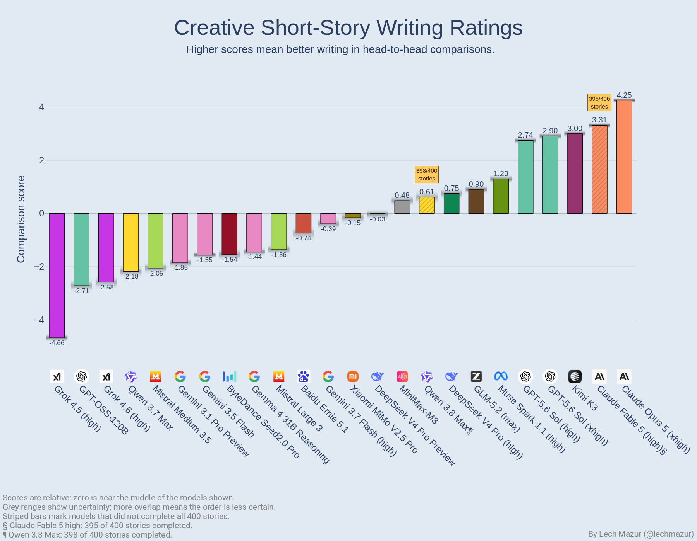
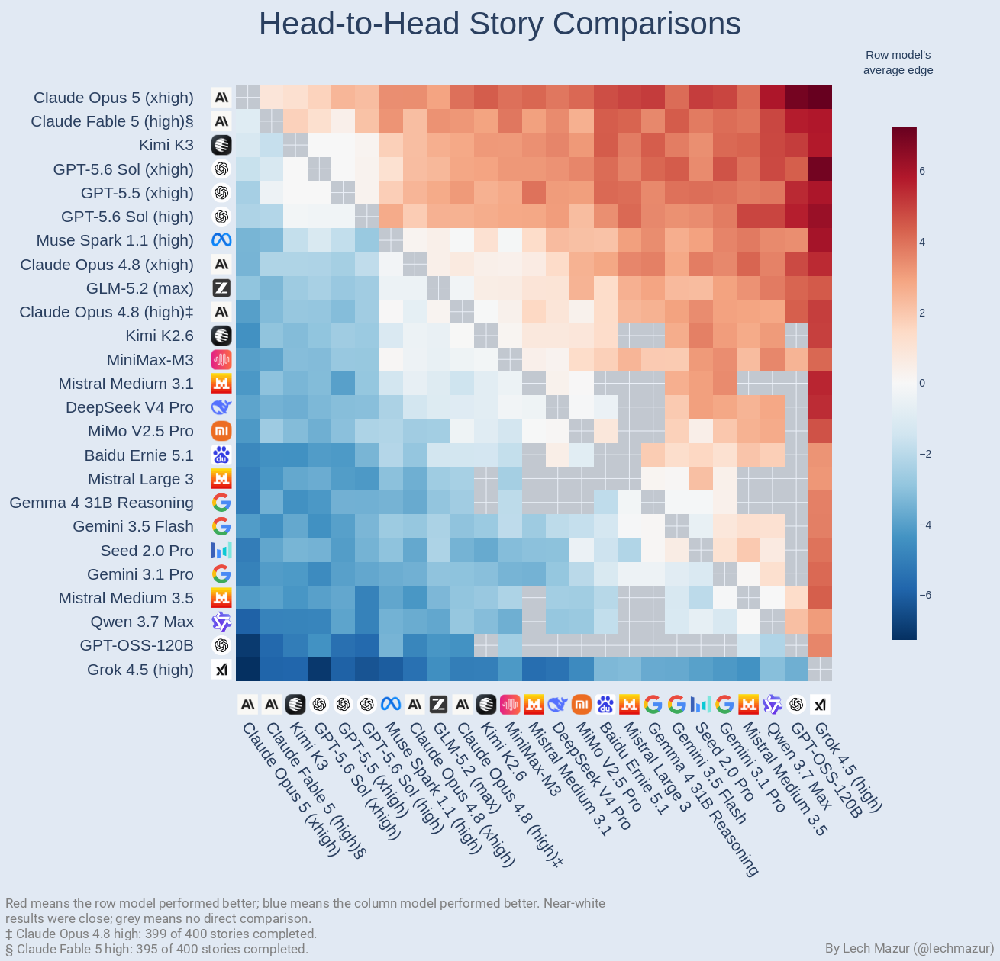
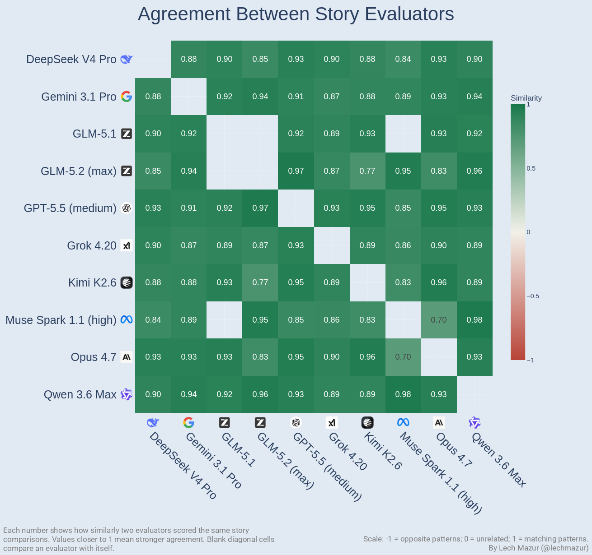
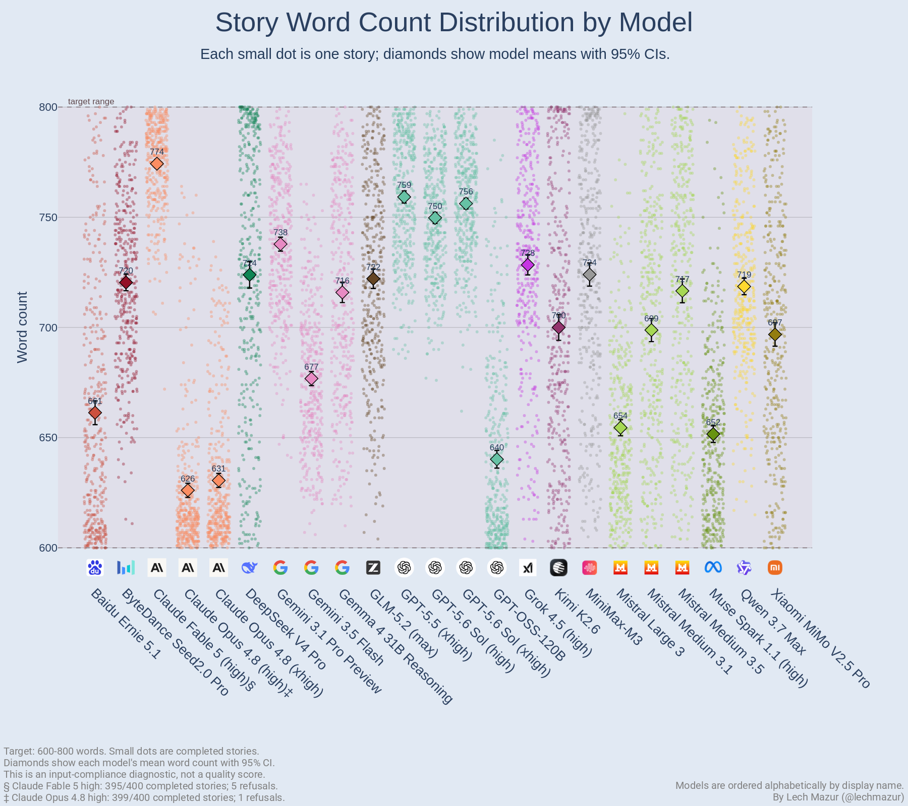

# LLM Creative Story-Writing Benchmark

This benchmark compares short stories written to the same constrained creative briefs. Separate evaluator models read matched story pairs and choose which one is better. Those choices are combined into a relative comparison score.

Higher scores mean stronger performance against the other models tested. Scores are relative, not grades: zero is near the middle of this comparison set, and overlapping uncertainty ranges can indicate similarly rated models.

---

## Current Results

### Leaderboard

Current comparison set:

- 40 rated models
- 499 direct model pairings
- 58,301 evaluator judgments
- the rating combines compatible evaluator-v2 and evaluator-v3 evidence after bridge validation
- the chart focuses on current models; the table retains all rated models for historical comparison
- striped bars and markers identify models that completed fewer than 400 stories

Labels such as `high`, `xhigh`, `max`, and `adaptive` identify the reasoning setting used for that model.
Estimated win chance is the model's average expected chance against another model in the full comparison set.

| Rank | Model | Comparison score | Estimated win chance | Uncertainty range |
|-----:|:------|-----------------:|---------------------:|:------------------|
| 1 | Claude Opus 5 (xhigh) | 4.3 | 96% | 4.2 to 4.4 |
| 2 | Claude Fable 5 (high)§ | 3.2 | 90% | 3.2 to 3.3 |
| 3 | Kimi K3 | 2.9 | 87% | 2.8 to 3.0 |
| 4 | GPT-5.6 Sol (xhigh) | 2.8 | 86% | 2.7 to 2.9 |
| 5 | GPT-5.5 (xhigh) | 2.8 | 86% | 2.7 to 2.9 |
| 6 | GPT-5.6 Sol (high) | 2.6 | 84% | 2.5 to 2.7 |
| 7 | GPT-5.4 (xhigh) | 2.4 | 81% | 2.2 to 2.5 |
| 8 | GPT-5.4 (medium) | 2.3 | 81% | 2.1 to 2.4 |
| 9 | Claude Opus 4.7 (adaptive)† | 2.2 | 80% | 2.1 to 2.3 |
| 10 | Claude Sonnet 4.6 (16K) | 2.0 | 78% | 1.9 to 2.1 |
| 11 | Claude Opus 4.6 (16K) | 1.5 | 71% | 1.3 to 1.7 |
| 12 | Muse Spark 1.1 (high) | 1.2 | 68% | 1.1 to 1.4 |
| 13 | Claude Opus 4.8 (xhigh) | 1.2 | 68% | 1.1 to 1.3 |
| 14 | GLM-5.2 (max) | 0.8 | 62% | 0.7 to 0.9 |
| 15 | GPT-5.2 (medium) | 0.7 | 61% | 0.6 to 0.9 |
| 16 | Claude Opus 4.8 (high)‡ | 0.7 | 61% | 0.6 to 0.9 |
| 17 | Kimi K2.6 | 0.5 | 58% | 0.4 to 0.6 |
| 18 | MiniMax-M3 | 0.5 | 57% | 0.3 to 0.6 |
| 19 | Mistral Medium 3.1 | 0.1 | 51% | -0.1 to 0.2 |
| 20 | DeepSeek V4 Pro | 0.0 | 49% | -0.2 to 0.1 |
| 21 | Xiaomi MiMo V2.5 Pro | -0.2 | 47% | -0.4 to -0.1 |
| 22 | Qwen 3 Max Preview | -0.2 | 46% | -0.4 to -0.1 |
| 23 | Qwen 3.6 Max Preview | -0.5 | 43% | -0.6 to -0.4 |
| 24 | GLM-5.1 | -0.6 | 41% | -0.8 to -0.4 |
| 25 | Kimi K2.5 | -0.6 | 41% | -0.8 to -0.4 |
| 26 | Xiaomi MiMo V2 Pro | -0.8 | 39% | -1.0 to -0.5 |
| 27 | Baidu Ernie 5.1 | -0.8 | 38% | -1.0 to -0.6 |
| 28 | Mistral Large 3 | -1.4 | 30% | -1.5 to -1.3 |
| 29 | Gemma 4 31B Reasoning | -1.5 | 29% | -1.6 to -1.4 |
| 30 | Gemini 3.5 Flash | -1.6 | 27% | -1.7 to -1.5 |
| 31 | ByteDance Seed2.0 Pro | -1.6 | 27% | -1.7 to -1.5 |
| 32 | Qwen 3.6 Plus | -1.8 | 24% | -2.0 to -1.6 |
| 33 | Gemini 3.1 Pro Preview | -1.9 | 23% | -2.0 to -1.8 |
| 34 | Mistral Medium 3.5 | -2.1 | 21% | -2.2 to -1.9 |
| 35 | Qwen 3.7 Max | -2.2 | 20% | -2.3 to -2.0 |
| 36 | DeepSeek V3.2 | -2.5 | 17% | -2.7 to -2.2 |
| 37 | GPT-OSS-120B | -2.8 | 14% | -2.9 to -2.6 |
| 38 | MiniMax-M2.7 | -3.4 | 9% | -3.5 to -3.2 |
| 39 | Grok 4.3 | -3.9 | 6% | -4.1 to -3.7 |
| 40 | Grok 4.5 (high) | -4.7 | 2% | -4.8 to -4.6 |

### Coverage Note

- † Claude Opus 4.7 completed 347 of 400 stories. Only completed stories were compared.
- ‡ Claude Opus 4.8 high completed 399 of 400 stories. Only completed stories were compared.
- § Claude Fable 5 high completed 395 of 400 stories. Only completed stories were compared.

---

## Head-to-Head Comparisons

Read each cell by row. Red means the row model performed better, blue means the column model performed better, and grey means the models were not directly compared. Near-white cells indicate close results. Both axes follow the leaderboard order.

---

## Diagnostics

### Evaluator Agreement

This chart shows how similarly the evaluator models scored the same story pairs. Values closer to 1 indicate stronger agreement; 0 means no consistent relationship, and negative values mean opposing scoring patterns.

### Word Count Compliance

Each dot is one story, and each diamond is a model's average length. Thin vertical lines show uncertainty around the averages. The shaded band is the 600-800-word target. This chart measures story length, not writing quality.

---

## What Is Measured

Every story must meaningfully incorporate ten required elements:

- character
- object
- concept
- attribute
- action
- method
- setting
- timeframe
- motivation
- tone

The comparison protocol keeps the prompt and required elements matched within each story pair. This makes the judgment about which story better satisfies the same creative brief, rather than which model happened to receive an easier prompt.

Evaluators consider required-element use, prose, coherence, character, originality, and overall effectiveness. The public score combines their choices; it is not an average 0-10 grade.

---

## Method Summary

1. Generate stories in the benchmark format.
2. Build matched story-comparison prompts for models that wrote to the same required elements.
3. Show each pair in both story orders to reduce first- or second-position effects.
4. Repeat comparisons across evaluators and combine their choices.
5. When an evaluator roster changes, validate shared prompts and bridge matchups before combining evidence.
6. Calculate relative model scores and their uncertainty ranges.

---

## Public Artifacts

The published bundle includes the story prompts and generated story text files for models visible in the public comparison charts. Prompt files are under `prompts_wc/`; model outputs are under `stories_wc/<model>/`.

---

## Archived Absolute Ratings

Earlier versions of this benchmark used absolute 0-10 rubric ratings rather than direct story comparisons. Those results remain historical context, but the current public quality ranking should use the pairwise comparison results above.

---

## Recent Updates
- July 25, 2026: Added Claude Opus 5.
- July 18, 2026: Added Kimi K3, updated evaluators.
- July 14, 2026: Added GPT-5.6, Muse Spark 1.1 high, and Grok 4.5.
- July 9, 2026: Added Grok 4.5.
- June 9, 2026: Added Claude Fable 5.
- May 29, 2026: Added Claude Opus 4.8 high and xhigh.
- May 26, 2026: Ernie 5.1, Qwen 3.7 Max, Mistral Medium 3.5, and Grok 4.3 added.
- May 20, 2026: Added Gemini 3.5 Flash.
- Apr 29, 2026: Refreshed the leaderboard with newer models, including GPT-5.5, Kimi K2.6, DeepSeek V4 Pro, Xiaomi MiMo V2.5 Pro, Qwen 3 Max Preview, Gemini 3.1 Pro Preview, ByteDance Seed2.0 Pro, Qwen 3.6 Max Preview, and MiniMax-M2.7.

---

## Related Benchmarks

Multi-agent benchmarks:

- [PACT - Benchmarking LLM negotiation skill in multi-round buyer-seller bargaining](https://github.com/lechmazur/pact)
- [BAZAAR - Evaluating LLMs in Economic Decision-Making within a Competitive Simulated Market](https://github.com/lechmazur/bazaar)
- [Buyout Game - Multi-Agent Negotiation and Coalition Benchmark](https://github.com/lechmazur/buyout_game)
- [LLM Debate Benchmark](https://github.com/lechmazur/debate)
- [Public Goods Game Benchmark: Contribute & Punish](https://github.com/lechmazur/pgg_bench/)
- [Elimination Game: Social Reasoning and Deception Under Pressure](https://github.com/lechmazur/elimination_game/)
- [Step Race: Collaboration vs. Misdirection Under Pressure](https://github.com/lechmazur/step_game/)
- [LLM Persuasion Benchmark](https://github.com/lechmazur/persuasion)

Other benchmarks:

- [LLM Position Bias Benchmark](https://github.com/lechmazur/position_bias)
- [LLM Round-Trip Translation Benchmark](https://github.com/lechmazur/translation/)
- [Extended NYT Connections](https://github.com/lechmazur/nyt-connections/)
- [LLM Thematic Generalization Benchmark](https://github.com/lechmazur/generalization/)
- [LLM Confabulation/Hallucination Benchmark](https://github.com/lechmazur/confabulations/)
- [LLM Deceptiveness and Gullibility](https://github.com/lechmazur/deception/)
- [LLM Sycophancy Benchmark](https://github.com/lechmazur/sycophancy)
- [LLM Divergent Thinking Creativity Benchmark](https://github.com/lechmazur/divergent/)

Follow [@lechmazur](https://x.com/LechMazur) on X for other benchmarks and updates.
