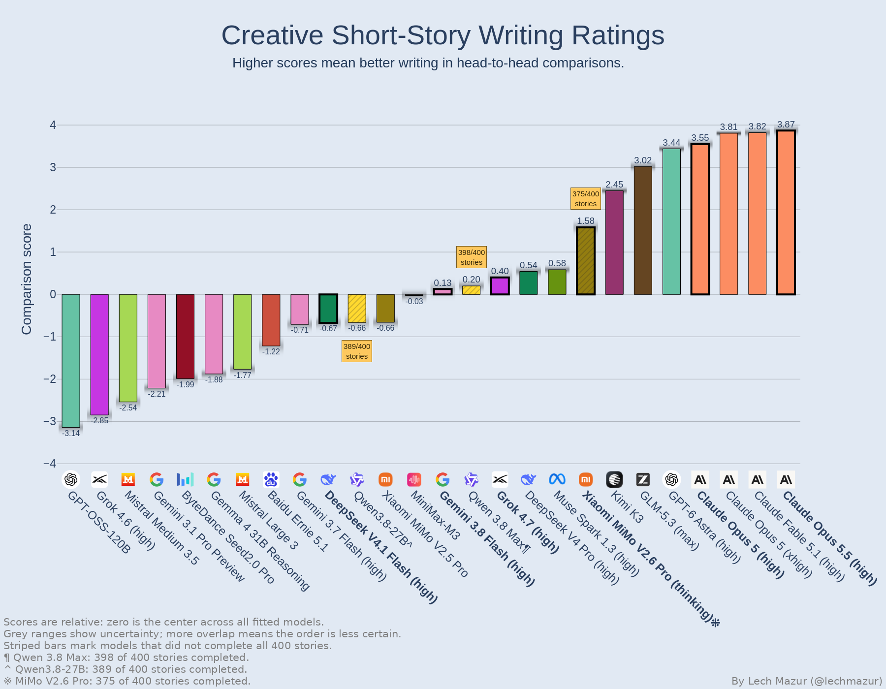
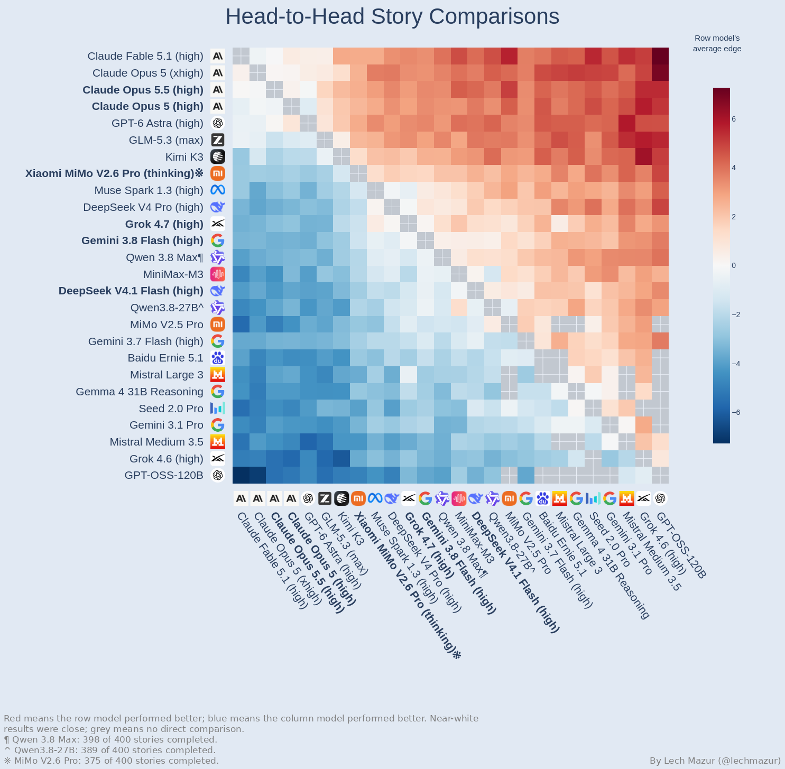
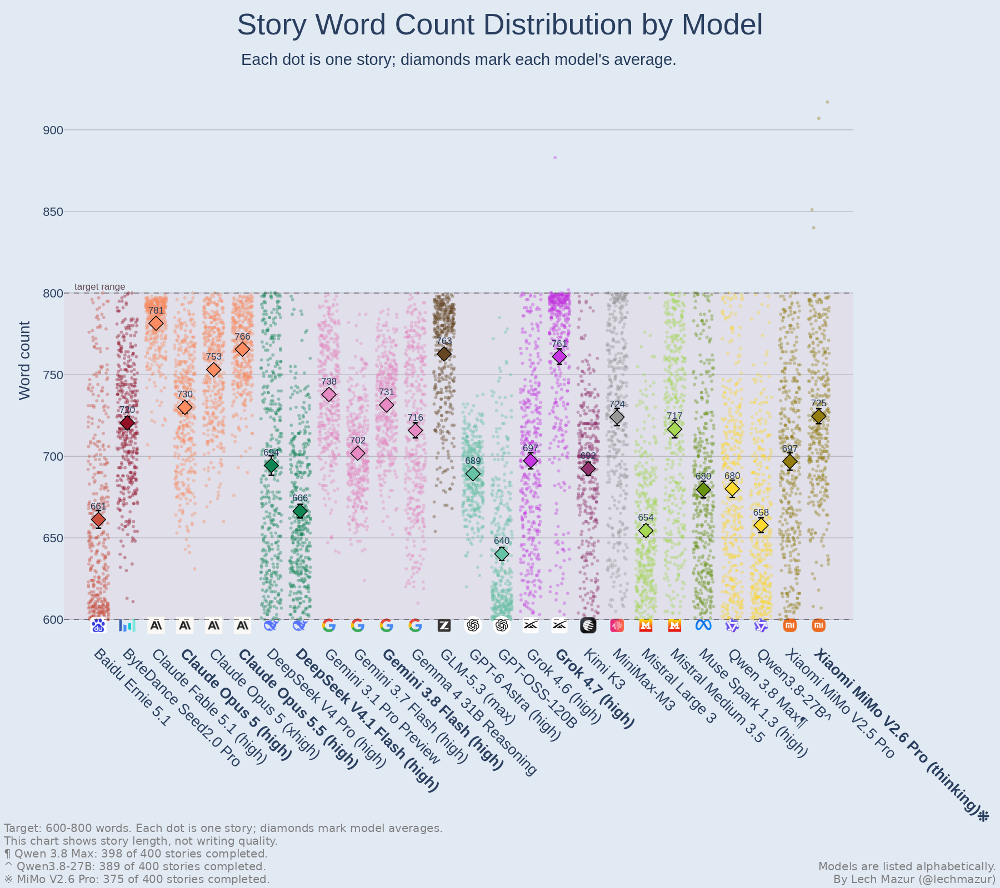

# LLM Creative Story-Writing Benchmark

This benchmark compares short stories written to the same constrained creative briefs. Separate evaluator models read matched stories in both orders and judge which is better. Their judgments produce relative scores for each writer model.

Higher ratings mean stronger estimated performance within this comparison set. Scores are centered at zero across all writer models in the comparison set.

## Current Results

The ranking combines judgments from earlier and newer evaluator models. It uses **99,309 judgments** across **14,624 distinct story pairs** and 56 writer models. The chart shows 26 current models, with the six recent additions highlighted.

The shaded ranges show how much scores vary across 300 resamples of stories and evaluators (bootstrap). The table gives the 95% bootstrap intervals. Estimated win chance is a model's average predicted probability of beating another model in the full comparison set.

### Leaderboard

| Rank | Model | Comparison score | Estimated win chance | 95% bootstrap interval |
| ---: | --- | ---: | ---: | --- |
| 1 | **Claude Opus 5.5 (high)** | 3.870 | 94% | 3.755 to 3.990 |
| 2 | Claude Fable 5.1 (high) | 3.822 | 93% | 3.721 to 3.921 |
| 3 | Claude Opus 5 (xhigh) | 3.805 | 93% | 3.752 to 3.865 |
| 4 | **Claude Opus 5 (high)** | 3.548 | 92% | 3.440 to 3.665 |
| 5 | GPT-6 Astra (high) | 3.439 | 91% | 3.362 to 3.506 |
| 6 | GLM-5.3 (max) | 3.022 | 88% | 2.905 to 3.120 |
| 7 | Kimi K3 | 2.451 | 82% | 2.371 to 2.520 |
| 8 | **Xiaomi MiMo V2.6 Pro (thinking)※** | 1.584 | 72% | 1.427 to 1.731 |
| 9 | Muse Spark 1.3 (high) | 0.584 | 59% | 0.490 to 0.675 |
| 10 | DeepSeek V4 Pro (high) | 0.544 | 58% | 0.429 to 0.658 |
| 11 | **Grok 4.7 (high)** | 0.400 | 56% | 0.191 to 0.610 |
| 12 | Qwen 3.8 Max¶ | 0.201 | 53% | 0.074 to 0.323 |
| 13 | **Gemini 3.8 Flash (high)** | 0.128 | 52% | -0.013 to 0.315 |
| 14 | MiniMax-M3 | -0.026 | 50% | -0.148 to 0.109 |
| 15 | Xiaomi MiMo V2.5 Pro | -0.659 | 40% | -0.793 to -0.542 |
| 16 | Qwen3.8-27B^ | -0.662 | 40% | -0.849 to -0.480 |
| 17 | **DeepSeek V4.1 Flash (high)** | -0.673 | 40% | -0.807 to -0.522 |
| 18 | Gemini 3.7 Flash (high) | -0.708 | 40% | -0.825 to -0.559 |
| 19 | Baidu Ernie 5.1 | -1.217 | 32% | -1.392 to -1.044 |
| 20 | Mistral Large 3 | -1.767 | 25% | -1.884 to -1.645 |
| 21 | Gemma 4 31B Reasoning | -1.879 | 24% | -1.988 to -1.782 |
| 22 | ByteDance Seed2.0 Pro | -1.988 | 22% | -2.117 to -1.844 |
| 23 | Gemini 3.1 Pro Preview | -2.212 | 20% | -2.305 to -2.098 |
| 24 | Mistral Medium 3.5 | -2.539 | 16% | -2.678 to -2.386 |
| 25 | Grok 4.6 (high) | -2.847 | 13% | -2.988 to -2.694 |
| 26 | GPT-OSS-120B | -3.141 | 11% | -3.275 to -3.014 |

[All 56 writers and machine-readable results](data/writing_predecessors_20260927/README.md)

### Coverage Note

- ※ MiMo V2.6 Pro: 375/400 stories completed.
- ¶ Qwen 3.8 Max: 398/400 stories completed.
- ^ Qwen3.8-27B: 389/400 stories completed.

Striped bars and badges identify incomplete story sets. Quality comparisons concern completed stories. The latest evaluations returned 19,802/19,860 planned judgments; 58 unavailable judgments are excluded from the scores. The Opus 5.5 high versus Opus 5 high comparison covers 50 matched prompts, with 298/300 usable judgments.

Grok 4.7 (high) versus Grok 4.6 (high): 50 matched prompts, 300/300 judgments. Xiaomi MiMo V2.6 Pro (thinking) versus Xiaomi MiMo V2.5 Pro: 50 matched prompts, 300/300 judgments.

## Head-to-Head Comparisons

Read each cell by row. Red means the row model performed better, blue means the column model performed better, and grey means the models were not directly compared. Near-white cells indicate close results. Both axes follow the leaderboard order. Earlier and newer evaluations contribute to both this chart and the rankings.

## Additional Results

### Evaluator Agreement

The matrix includes earlier and newer evaluator models. Each number shows how similarly two evaluators scored the story pairs they both read: positive correlations indicate agreement, and negative correlations indicate disagreement. Blank cells lack enough varied judgments to calculate a correlation; the diagonal is omitted. Agreement on these stories does not establish evaluator accuracy.

GLM-5.1 / Muse Spark 1.1 (high): only two shared stories. [Shared-story counts](data/writing_predecessors_20260927/evaluator_agreement.csv) accompany every evaluator pair.

### Word Count Compliance

Each dot is one completed story; diamonds mark model averages. The shaded band is the 600–800-word target. The chart includes 10,362 completed stories from all 26 displayed models. This measures length rather than writing quality.

### Combining Evaluations Over Time

Earlier and newer evaluators use the same instructions and scoring criteria. They have judged 1,200 of the same story pairs, covering all previously tested writer models. Different evaluator versions count separately, with one averaged judgment per evaluator on each story pair. Each story pair receives equal weight in the ranking. Ratings use a Thurstone statistical model with a correction for story presentation order.

The intervals reflect variation in completed comparisons. They do not account for how missing stories or judgments might change the scores, or how results would differ if only newer evaluators were used. Overlapping intervals mean small differences in rank may be uncertain.

---

## What Is Measured

Every story must meaningfully incorporate ten required elements:

- character
- object
- concept
- attribute
- action
- method
- setting
- timeframe
- motivation
- tone

Candidate combinations are independently rated for coherence and originality. The highest-rated combinations become fixed briefs used by every writer model. A typical brief might combine a neutron-star researcher, butterfly-wing dust, gradual change, a storm-damaged greenhouse, "after the flood," and kindled humility.

Evaluators reward integration rather than keyword inclusion: the required object should affect the plot, the motivation should produce a consequential choice, and the tone should shape the story's development. Both stories in every comparison answer the same brief, holding prompt difficulty constant. Evaluators also consider prose, coherence, character, originality, and overall effectiveness. The public score combines their choices; it is not an average 0-10 grade.

Because the combinations are pre-screened for creative potential, the benchmark measures story construction under deliberately combinable constraints—not completely free-form writing or recovery from arbitrary incoherent prompts.

---

## Method Summary

1. Generate stories in the benchmark format.
2. Build matched story-comparison prompts for models that wrote to the same required elements.
3. Show each pair in both story orders to reduce first- or second-position effects.
4. Repeat comparisons across evaluators and combine their choices.
5. When evaluator models change, compare their judgments on shared stories before combining results.
6. Calculate relative model scores and their uncertainty ranges.

---

## Qualitative Pair Reports

Each report describes the models and stories compared. The Opus 5.5, Grok 4.7, and MiMo V2.6 Pro reports use newer evaluators; earlier reports use the evaluators available at the time.

[New Models Compared with Their Predecessors](reports/pair_analysis/new_models_compared_with_predecessors.md) collects twelve release-to-predecessor reports on a separate page.

New analyses give recurring writing habits, range and adaptability, and consistency separate treatment, with examples across different prompts. They examine repeated phrasing and story patterns as well as how flexibly each model changes its voice, tone, form, and narrative approach.

---

## Data, Stories, and Prompts

Story prompts are available under `prompts_wc/`, and generated stories under `stories_wc/<model>/`.

[Current ratings and chart data](data/writing_predecessors_20260927/README.md) include scores, uncertainty intervals, and individual comparisons. [Earlier benchmark data](data/README.md) includes previous results and an archived release of prompts, stories, and written evaluations.

---

## Archived Absolute Ratings

Earlier versions of this benchmark used absolute 0-10 rubric ratings rather than direct story comparisons. Those results remain historical context, but the current public quality ranking should use the pairwise comparison results above.

---

## Recent Updates

- September 27, 2026: Added Grok 4.7 versus Grok 4.6 and MiMo V2.6 Pro versus V2.5 Pro comparisons across 50 matched prompts each, with detailed reports.

- September 27, 2026: Updated the rankings using earlier and newer evaluations. Expanded the Opus 5.5 high versus Opus 5 high comparison to 50 matched prompts and added a detailed report.
- September 26, 2026: Added six writer models and updated the evaluators.
- September 5, 2026: Added GPT-6 Astra high, Muse Spark 1.3.
- September 2, 2026: Added Claude Fable 5.1.
- August 23, 2026: Published comparison data and written evaluations.
- August 20, 2026: Added Muse Spark 1.2 high, DeepSeek V4 Pro high, Qwen 3.8 Max, Gemini 3.7 Flash high, and Grok 4.6 high. Added predecessor reports.
- July 25, 2026: Added Claude Opus 5.
- July 18, 2026: Added Kimi K3, updated evaluators.
- July 14, 2026: Added GPT-5.6, Muse Spark 1.1 high, and Grok 4.5.
- July 9, 2026: Added Grok 4.5.
- June 9, 2026: Added Claude Fable 5.
- May 29, 2026: Added Claude Opus 4.8 high and xhigh.
- May 26, 2026: Ernie 5.1, Qwen 3.7 Max, Mistral Medium 3.5, and Grok 4.3 added.
- May 20, 2026: Added Gemini 3.5 Flash.
- Apr 29, 2026: Refreshed the leaderboard with newer models, including GPT-5.5, Kimi K2.6, DeepSeek V4 Pro, Xiaomi MiMo V2.5 Pro, Qwen 3 Max Preview, Gemini 3.1 Pro Preview, ByteDance Seed2.0 Pro, Qwen 3.6 Max Preview, and MiniMax-M2.7.

---

## Related Benchmarks

Multi-agent benchmarks:

- [PACT - Benchmarking LLM negotiation skill in multi-round buyer-seller bargaining](https://github.com/lechmazur/pact)
- [BAZAAR - Evaluating LLMs in Economic Decision-Making within a Competitive Simulated Market](https://github.com/lechmazur/bazaar)
- [Buyout Game - Multi-Agent Negotiation and Coalition Benchmark](https://github.com/lechmazur/buyout_game)
- [LLM Debate Benchmark](https://github.com/lechmazur/debate)
- [Public Goods Game Benchmark: Contribute & Punish](https://github.com/lechmazur/pgg_bench/)
- [Elimination Game: Social Reasoning and Deception Under Pressure](https://github.com/lechmazur/elimination_game/)
- [Step Race: Collaboration vs. Misdirection Under Pressure](https://github.com/lechmazur/step_game/)
- [LLM Persuasion Benchmark](https://github.com/lechmazur/persuasion)

Other benchmarks:

- [LLM Position Bias Benchmark](https://github.com/lechmazur/position_bias)
- [LLM Round-Trip Translation Benchmark](https://github.com/lechmazur/translation/)
- [Extended NYT Connections](https://github.com/lechmazur/nyt-connections/)
- [LLM Thematic Generalization Benchmark](https://github.com/lechmazur/generalization/)
- [LLM Confabulation/Hallucination Benchmark](https://github.com/lechmazur/confabulations/)
- [LLM Deceptiveness and Gullibility](https://github.com/lechmazur/deception/)
- [LLM Sycophancy Benchmark](https://github.com/lechmazur/sycophancy)
- [LLM Divergent Thinking Creativity Benchmark](https://github.com/lechmazur/divergent/)

Follow [@lechmazur](https://x.com/LechMazur) on X for other benchmarks and updates.
