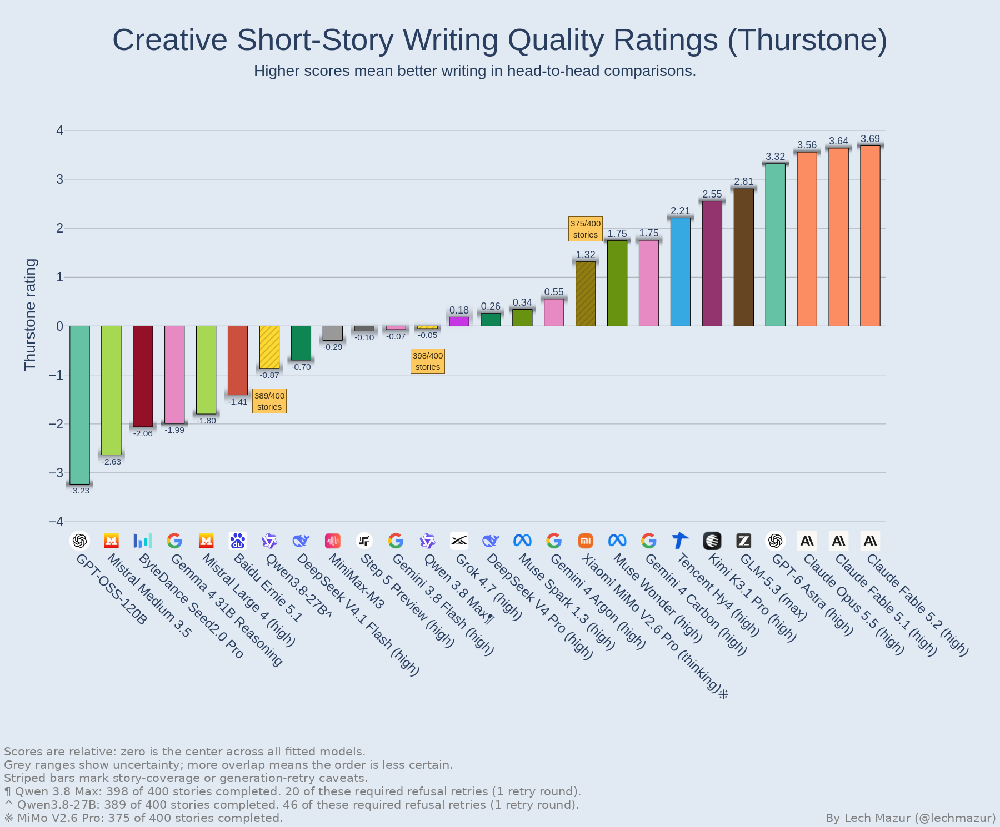
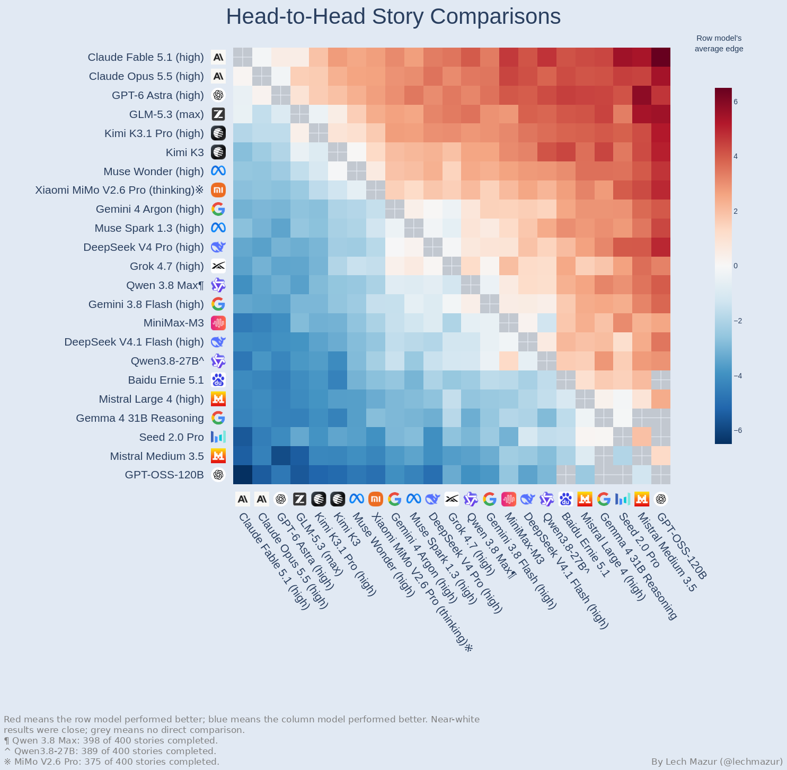
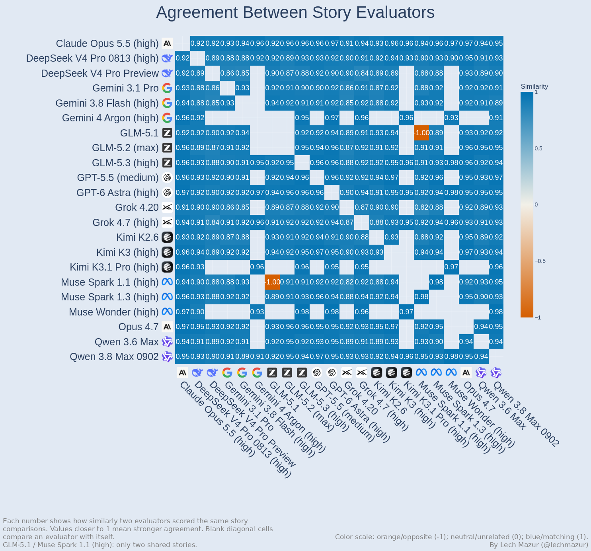
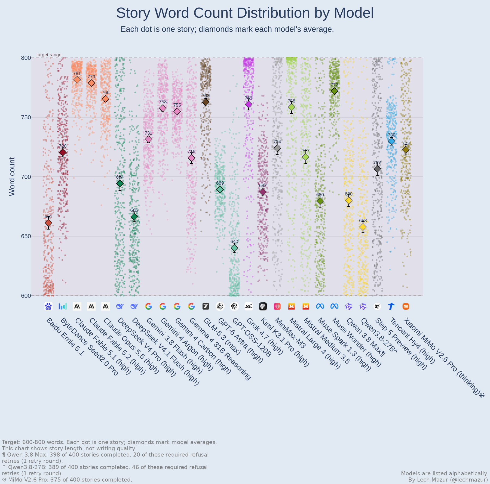

# LLM Creative Story-Writing Benchmark

This benchmark compares short stories written to the same constrained creative briefs. Separate evaluator models read matched stories in both orders and judge which is better. Their judgments produce relative scores for each writer model.

Higher ratings mean stronger estimated performance within this comparison set. Scores are centered at zero across all writer models in the comparison set.

## Current Results

The ranking combines judgments from earlier and newer evaluator models. It covers **64 writer models**, **1,093 direct model pairings**, **18,902 distinct story pairs**, and **124,844 judgments**. Each direct model pairing can include stories from multiple matched prompts. The chart shows 26 selected models; the table lists every rated model with its overall rank.

The shaded ranges show how much scores vary across 300 resamples of stories and evaluators (bootstrap). The table gives the 95% bootstrap intervals. Estimated win chance is a model's average predicted probability of beating another model in the full comparison set.

### Leaderboard

| Rank | Model | Comparison score | Estimated win chance | 95% bootstrap interval |
| ---: | --- | ---: | ---: | --- |
| 1 | **Claude Fable 5.2 (high)** | 3.687 | 93% | 3.623 to 3.771 |
| 2 | Claude Fable 5.1 (high) | 3.636 | 93% | 3.560 to 3.722 |
| 3 | Claude Opus 5 (xhigh) | 3.558 | 92% | 3.496 to 3.617 |
| 4 | Claude Opus 5.5 (high) | 3.555 | 92% | 3.470 to 3.635 |
| 5 | GPT-6 Astra (high) | 3.318 | 91% | 3.254 to 3.382 |
| 6 | Claude Opus 5 (high) | 3.180 | 89% | 3.086 to 3.284 |
| 7 | GLM-5.3 (max) | 2.806 | 86% | 2.713 to 2.889 |
| 8 | Claude Fable 5 (high)§ | 2.691 | 85% | 2.629 to 2.755 |
| 9 | Kimi K3.1 Pro (high) | 2.550 | 83% | 2.461 to 2.639 |
| 10 | GPT-5.6 Sol (xhigh) | 2.305 | 81% | 2.226 to 2.386 |
| 11 | GPT-5.5 (xhigh) | 2.273 | 81% | 2.207 to 2.336 |
| 12 | Kimi K3 | 2.218 | 80% | 2.143 to 2.289 |
| 13 | **Tencent Hy4 (high)** | 2.211 | 80% | 2.121 to 2.297 |
| 14 | GPT-5.6 Sol (high) | 2.118 | 79% | 2.031 to 2.192 |
| 15 | GPT-5.4 (medium) | 1.799 | 75% | 1.651 to 1.918 |
| 16 | GPT-5.4 (xhigh) | 1.793 | 75% | 1.681 to 1.896 |
| 17 | **Gemini 4 Carbon (high)** | 1.752 | 74% | 1.670 to 1.860 |
| 18 | Muse Wonder (high) | 1.749 | 74% | 1.674 to 1.826 |
| 19 | Claude Opus 4.7 (high)† | 1.601 | 72% | 1.500 to 1.709 |
| 20 | Claude Sonnet 4.6 Thinking 16K | 1.490 | 71% | 1.385 to 1.598 |
| 21 | Xiaomi MiMo V2.6 Pro (thinking)※ | 1.318 | 69% | 1.204 to 1.435 |
| 22 | Claude Opus 4.6 Thinking 16K | 0.960 | 64% | 0.804 to 1.123 |
| 23 | Claude Opus 4.8 (xhigh) | 0.602 | 59% | 0.499 to 0.711 |
| 24 | Muse Spark 1.1 (high) | 0.598 | 59% | 0.479 to 0.697 |
| 25 | Gemini 4 Argon (high) | 0.551 | 58% | 0.453 to 0.654 |
| 26 | Muse Spark 1.3 (high) | 0.340 | 55% | 0.247 to 0.426 |
| 27 | GLM-5.2 (max) | 0.291 | 54% | 0.178 to 0.393 |
| 28 | DeepSeek V4 Pro (high) | 0.258 | 54% | 0.161 to 0.368 |
| 29 | Grok 4.7 (high) | 0.183 | 52% | -0.002 to 0.362 |
| 30 | GPT-5.2 (medium) | 0.164 | 52% | -0.002 to 0.317 |
| 31 | Claude Opus 4.8 (high)‡ | 0.089 | 51% | -0.001 to 0.200 |
| 32 | Qwen 3.8 Max¶ | -0.052 | 49% | -0.148 to 0.038 |
| 33 | Gemini 3.8 Flash (high) | -0.075 | 49% | -0.178 to 0.039 |
| 34 | Kimi K2.6 | -0.085 | 48% | -0.181 to 0.027 |
| 35 | **Step 5 Preview (high)** | -0.103 | 48% | -0.228 to 0.021 |
| 36 | Muse Spark 1.2 (high) | -0.220 | 46% | -0.313 to -0.115 |
| 37 | MiniMax-M3 | -0.294 | 45% | -0.415 to -0.182 |
| 38 | Mistral Medium 3.1 | -0.554 | 41% | -0.690 to -0.418 |
| 39 | DeepSeek V4.1 Flash (high) | -0.697 | 39% | -0.792 to -0.599 |
| 40 | DeepSeek V4 Pro Preview | -0.708 | 39% | -0.826 to -0.600 |
| 41 | Xiaomi MiMo V2.5 Pro | -0.848 | 37% | -0.987 to -0.713 |
| 42 | Qwen 3 Max Preview | -0.852 | 37% | -1.045 to -0.671 |
| 43 | Qwen3.8-27B^ | -0.866 | 37% | -0.986 to -0.733 |
| 44 | Gemini 3.7 Flash (high) | -0.886 | 37% | -1.012 to -0.760 |
| 45 | Qwen 3.6 Max Preview | -1.098 | 34% | -1.219 to -0.983 |
| 46 | GLM-5.1 | -1.196 | 32% | -1.346 to -1.018 |
| 47 | Kimi K2.5 Thinking | -1.250 | 31% | -1.418 to -1.092 |
| 48 | Xiaomi MiMo V2 Pro | -1.379 | 30% | -1.617 to -1.158 |
| 49 | Baidu Ernie 5.1 | -1.408 | 29% | -1.546 to -1.292 |
| 50 | Mistral Large 4 (high) | -1.799 | 24% | -1.891 to -1.694 |
| 51 | Mistral Large 3 | -1.937 | 23% | -2.058 to -1.808 |
| 52 | Gemma 4 31B Reasoning | -1.991 | 22% | -2.065 to -1.910 |
| 53 | ByteDance Seed2.0 Pro | -2.059 | 21% | -2.174 to -1.960 |
| 54 | Gemini 3.5 Flash | -2.148 | 20% | -2.248 to -2.062 |
| 55 | Gemini 3.1 Pro Preview | -2.334 | 18% | -2.425 to -2.223 |
| 56 | Qwen 3.6 Plus | -2.446 | 17% | -2.633 to -2.260 |
| 57 | Mistral Medium 3.5 | -2.633 | 15% | -2.753 to -2.498 |
| 58 | Qwen 3.7 Max | -2.827 | 13% | -2.948 to -2.708 |
| 59 | DeepSeek V3.2 | -3.028 | 12% | -3.279 to -2.796 |
| 60 | Grok 4.6 (high) | -3.060 | 11% | -3.221 to -2.914 |
| 61 | GPT-OSS-120B | -3.233 | 10% | -3.318 to -3.139 |
| 62 | MiniMax-M2.7 | -3.922 | 6% | -4.062 to -3.790 |
| 63 | Grok 4.3 | -4.412 | 4% | -4.574 to -4.226 |
| 64 | Grok 4.5 (high) | -5.246 | 1% | -5.341 to -5.160 |

### Coverage Note

- † Claude Opus 4.7: 347 of 400 stories completed.
- ‡ Claude Opus 4.8 high: 399 of 400 stories completed.
- § Claude Fable 5 high: 395 of 400 stories completed.
- ¶ Qwen 3.8 Max: 398 of 400 stories completed. 20 of these required refusal retries (1 retry round).
- ^ Qwen3.8-27B: 389 of 400 stories completed. 46 of these required refusal retries (1 retry round).
- ※ MiMo V2.6 Pro: 375 of 400 stories completed.

Striped bars and badges identify story-coverage or generation-retry caveats. Quality comparisons concern completed stories. The latest evaluations returned 45,337/45,528 planned judgments; 191 unavailable judgments are excluded from the scores. The Opus 5.5 high versus Opus 5 high comparison covers 50 matched prompts, with 298/300 usable judgments.

Mistral Large 4 (high) completed all 400 prompts. Stories outside 600–800 words were regenerated from their original prompts, retaining the first response within range; 43 prompts required another draw, for 446 total generation calls. Its comparisons cover 26 opponents, including Mistral Large 3, with 20 matched stories per opponent and 3,112/3,120 usable judgments. [Comparison coverage](data/writing_mistral_large4_20261007/mistral_matchup_coverage.csv).

Muse Wonder (high) completed all 400 prompts. Stories outside 600–800 words were regenerated from their original prompts, retaining the first response within range; 2 prompts required another draw, for 402 total generation calls. Its comparisons cover 21 opponents, including Muse Spark 1.3 (high), with 20 matched stories per opponent and 2,467/2,520 usable judgments. [Comparison coverage](data/writing_gemini_argon_20261013/muse_wonder_matchup_coverage.csv).

Gemini 4 Argon (high) completed all 400 prompts. Stories outside 600–800 words were regenerated from their original prompts, retaining the first response within range; 0 prompts required another draw, for 410 total generation calls. Its comparisons cover 22 opponents, including Gemini 3.8 Flash (high) and Muse Wonder (high), with 20 matched stories per opponent and 2,577/2,640 usable judgments. [Comparison coverage](data/writing_gemini_argon_20261013/gemini_argon_matchup_coverage.csv). 10 provider failures returned no story text; a documented retry recovered 10 stories. Those failed calls are included in the generation total and excluded from the length-redraw count.

Kimi K3.1 Pro (high) completed all 400 prompts, accepting the first 600–800-word response to each prompt. There were 400 generation calls and 0 prompts needing another draw; accepted lengths range from 612 to 776 words. Its comparisons cover 22 opponents, including Kimi K3, with 20 matched stories per opponent and 50 against Kimi K3, for 2,818/2,820 usable judgments. [Comparison coverage](data/writing_kimi_k31_depth50_20261024/kimi_k31_matchup_coverage.csv).

Claude Fable 5.2 (high), Tencent Hy4 (high), Step 5 Preview (high), Gemini 4 Carbon (high) each completed all 400 prompts within the 600–800-word target. Their comparisons cover 94 direct model pairings and 1,880 matched story pairs, with 11,278/11,280 usable judgments. [Comparison coverage](data/writing_november_writers_20261112/november_matchup_coverage.csv).

Claude Fable 5.2 (high) initially refused 58 of the 400 prompts. Three retry rounds recovered 48, 7 and 3 stories. Each recovered story is the first successful output for its prompt; these 58 later generation draws remain a resampling caveat despite complete story availability.

## Head-to-Head Comparisons

Read each cell by row. Red means the row model performed better, blue means the column model performed better, and grey means the models were not directly compared. Near-white cells indicate close results. Both axes follow the leaderboard order. Earlier and newer evaluations contribute to both this chart and the rankings.

The [Claude Fable 5.2 (high) versus Claude Fable 5.1 (high) qualitative comparison](reports/pair_analysis/claude-fable-5-2-high__vs__claude-fable-5-1-high__comparator_v2_eval_v5_fable52_vs_51_20261112_n50__subjective_v5_habits_range_evidence16_compact.md) examines recurring habits, range and narrative choices across 50 matched prompts, with blinded readings from three independent model families and Astra's synthesis. [Quantitative comparison](reports/pair_analysis/claude-fable-5-2-high__vs__claude-fable-5-1-high__comparator_v2_eval_v5_fable52_vs_51_20261112_n50__quantitative.md): 300/300 usable judgments, retaining the original 20 prompts and adding 30 unused prompts. Fable 5.2 wins 39, ties six and loses five at the story-level margin threshold. These additional comparisons support the focused report and are separate from the main leaderboard's intake sample.

The [Kimi K3.1 Pro (high) versus Kimi K3 qualitative comparison](reports/pair_analysis/kimi-k3.1-pro-high__vs__kimi-k3__comparator_v2_eval_v4_kimi_k31_vs_k3_20261024_n50__subjective_v5_habits_range.md) examines style, narrative control, recurring habits, and range across 50 matched prompts, with blinded readings from three independent model families. [Quantitative comparison](reports/pair_analysis/kimi-k3.1-pro-high__vs__kimi-k3__comparator_v2_eval_v4_kimi_k31_vs_k3_20261024_n50__quantitative.md): 300/300 usable judgments, retaining the original 20 prompts and adding 30 previously unused prompts. All 50 prompts now contribute to the leaderboard and head-to-head chart.

The [Gemini 4 Argon (high) versus Gemini 3.1 Pro Preview comparison](reports/pair_analysis/gemini-4-argon-high__vs__gemini-3.1-pro-preview__comparator_v2_eval_v4_gemini_argon_vs_gemini31_20261013_n50__quantitative.md) covers 50 matched prompts and 294/300 usable judgments. Argon wins all 50 at the story-level margin threshold; six unavailable judgments are excluded. These additional comparisons support the focused report and are separate from the main leaderboard's intake sample.

## Additional Results

### Evaluator Agreement

The matrix includes earlier and newer evaluator models. Each number shows how similarly two evaluators scored the story pairs they both read. Values closer to 1 indicate stronger agreement; 0 means no consistent relationship, and negative values mean opposing scoring patterns. Orange indicates negative correlations, and blue indicates positive correlations. Blank cells lack enough varied judgments to calculate a correlation; the diagonal is omitted. Agreement on these stories does not establish evaluator accuracy.

GLM-5.1 / Muse Spark 1.1 (high): only two shared stories. [Shared-story counts](data/writing_november_writers_20261112/evaluator_agreement.csv) accompany every evaluator pair.

### Word Count Compliance

Each dot is one completed story; diamonds mark model averages. Thin vertical lines show uncertainty around the averages. The shaded band is the 600–800-word target. The chart includes 10,362 completed stories from all 26 displayed models. This measures length rather than writing quality.

Before the Mistral intake, six stories that exceeded 800 words were regenerated using their original prompts; the first replacement within 600–800 words was retained. The 12 comparisons that used a replaced story were rerun with the same evaluators and both story orders. The rankings and charts use these replacements.

### Combining Evaluations Over Time

Earlier and newer evaluators use the same instructions and scoring criteria. They have judged 1,200 of the same story pairs, covering all previously tested writer models. Different evaluator versions count separately, with one averaged judgment per evaluator on each story pair. Each story pair receives equal weight in the ranking. Ratings use a Thurstone statistical model with a correction for story presentation order.

The intervals reflect variation in completed comparisons. They do not account for how missing stories or judgments might change the scores, or how results would differ if only newer evaluators were used. Overlapping intervals mean small differences in rank may be uncertain.

---

## What Is Measured

Every story must meaningfully incorporate ten required elements:

- character
- object
- concept
- attribute
- action
- method
- setting
- timeframe
- motivation
- tone

Candidate combinations are proposed for coherence and originality, then independently rated. The strongest combination for each seed becomes a fixed brief used by every writer model. A typical brief might combine a neutron-star researcher, butterfly-wing dust, gradual change, a storm-damaged greenhouse, "after the flood," and kindled humility.

Evaluators reward integration rather than keyword inclusion: the required object should affect the plot, the motivation should produce a consequential choice, and the tone should shape the story's development. Both stories in every comparison answer the same brief, holding prompt difficulty constant. Evaluators also consider prose, coherence, character, originality, and overall effectiveness. The public score combines their choices; it is not an average 0-10 grade.

Because the combinations are pre-screened for creative potential, the benchmark measures story construction under deliberately combinable constraints—not completely free-form writing or recovery from arbitrary incoherent prompts.

---

## Method Summary

1. Generate stories in the benchmark format.
2. Build matched story-comparison prompts for models that wrote to the same required elements.
3. Show each pair in both story orders to reduce first- or second-position effects.
4. Repeat comparisons across evaluators and combine their choices.
5. When evaluator models change, compare their judgments on shared stories before combining results.
6. Calculate relative model scores and their uncertainty ranges.

---

## Qualitative Pair Reports

Each report describes its matched stories and evaluator panel. Reports retain the sources and evaluators used at the time.

[New Models Compared with Their Predecessors](reports/pair_analysis/new_models_compared_with_predecessors.md) collects fifteen release comparisons, including Gemini 4 Argon versus Gemini 3.1 Pro Preview, on a separate page.

New analyses give recurring writing habits, range and adaptability, and consistency separate treatment, with examples across different prompts. They examine repeated phrasing and story patterns as well as how flexibly each model changes its voice, tone, form, and narrative approach.

---

## Data, Stories, and Prompts

Story prompts are available under `prompts_wc/`, and generated stories under `stories_wc/<model>/`.

[Current ratings and chart data](data/writing_november_writers_20261112/README.md) include machine-readable leaderboard scores and uncertainty intervals, direct head-to-head results, matched story-pair results, and evaluator diagnostics.

[Earlier benchmark data](data/README.md) links to the immutable August 23, 2026 data release. That archive contains the exact evaluator commentary for both story orders, excluded or superseded responses, and the accompanying source story and prompt texts.

---

## Archived Absolute Ratings

Earlier versions of this benchmark used absolute 0-10 rubric ratings rather than direct story comparisons. Those results remain historical context, but the current public quality ranking should use the pairwise comparison results above.

---

## Recent Updates

- November 12, 2026: Added Claude Fable 5.2 high, Tencent Hy4 high, Step 5 Preview high, and Gemini 4 Carbon high.
- October 23, 2026: Added Kimi K3.1 Pro high.
- October 13, 2026: Added Gemini 4 Argon high.
- October 13, 2026: Added Muse Wonder high.
- October 8, 2026: Added Mistral Large 4 high.
- September 26, 2026: Added Claude Opus 5.5 high, Claude Opus 5 high, MiMo V2.6 Pro thinking, DeepSeek V4.1 Flash high, Gemini 3.8 Flash high, and Grok 4.7 high.
- September 5, 2026: Added GPT-6 Astra high, Muse Spark 1.3.
- September 2, 2026: Added Claude Fable 5.1.
- August 23, 2026: Published comparison data and written evaluations.
- August 20, 2026: Added Muse Spark 1.2 high, DeepSeek V4 Pro high, Qwen 3.8 Max, Gemini 3.7 Flash high, and Grok 4.6 high. Added predecessor reports.
- July 25, 2026: Added Claude Opus 5.
- July 18, 2026: Added Kimi K3, updated evaluators.
- July 14, 2026: Added GPT-5.6, Muse Spark 1.1 high, and Grok 4.5.
- July 9, 2026: Added Grok 4.5.
- June 9, 2026: Added Claude Fable 5.
- May 29, 2026: Added Claude Opus 4.8 high and xhigh.
- May 26, 2026: Ernie 5.1, Qwen 3.7 Max, Mistral Medium 3.5, and Grok 4.3 added.
- May 20, 2026: Added Gemini 3.5 Flash.
- Apr 29, 2026: Refreshed the leaderboard with newer models, including GPT-5.5, Kimi K2.6, DeepSeek V4 Pro, Xiaomi MiMo V2.5 Pro, Qwen 3 Max Preview, Gemini 3.1 Pro Preview, ByteDance Seed2.0 Pro, Qwen 3.6 Max Preview, and MiniMax-M2.7.

---

## Related Benchmarks

Multi-agent benchmarks:

- [PACT - Benchmarking LLM negotiation skill in multi-round buyer-seller bargaining](https://github.com/lechmazur/pact)
- [BAZAAR - Evaluating LLMs in Economic Decision-Making within a Competitive Simulated Market](https://github.com/lechmazur/bazaar)
- [Buyout Game - Multi-Agent Negotiation and Coalition Benchmark](https://github.com/lechmazur/buyout_game)
- [LLM Debate Benchmark](https://github.com/lechmazur/debate)
- [Public Goods Game Benchmark: Contribute & Punish](https://github.com/lechmazur/pgg_bench/)
- [Elimination Game: Social Reasoning and Deception Under Pressure](https://github.com/lechmazur/elimination_game/)
- [Step Race: Collaboration vs. Misdirection Under Pressure](https://github.com/lechmazur/step_game/)
- [LLM Persuasion Benchmark](https://github.com/lechmazur/persuasion)

Other benchmarks:

- [LLM Position Bias Benchmark](https://github.com/lechmazur/position_bias)
- [LLM Round-Trip Translation Benchmark](https://github.com/lechmazur/translation/)
- [Extended NYT Connections](https://github.com/lechmazur/nyt-connections/)
- [LLM Thematic Generalization Benchmark](https://github.com/lechmazur/generalization/)
- [LLM Confabulation/Hallucination Benchmark](https://github.com/lechmazur/confabulations/)
- [LLM Deceptiveness and Gullibility](https://github.com/lechmazur/deception/)
- [LLM Sycophancy Benchmark](https://github.com/lechmazur/sycophancy)
- [LLM Divergent Thinking Creativity Benchmark](https://github.com/lechmazur/divergent/)

Follow [@lechmazur](https://x.com/LechMazur) on X for other benchmarks and updates.
