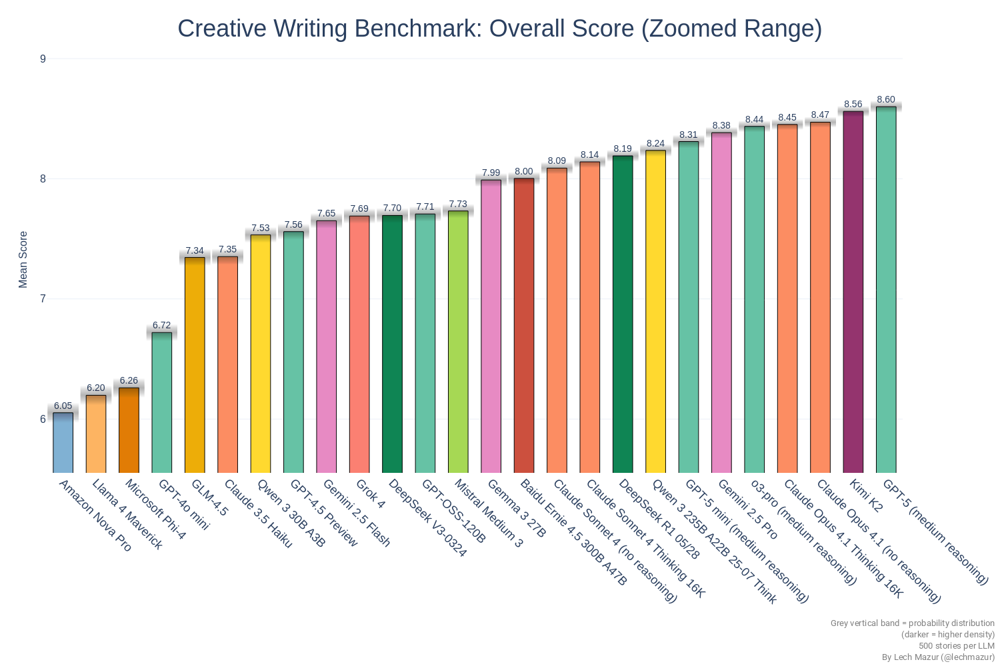
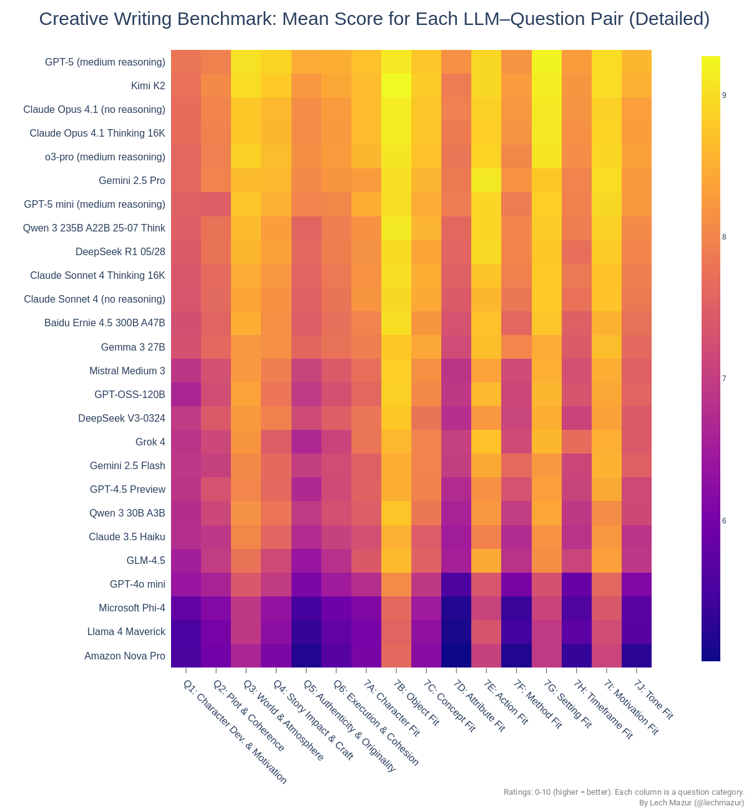
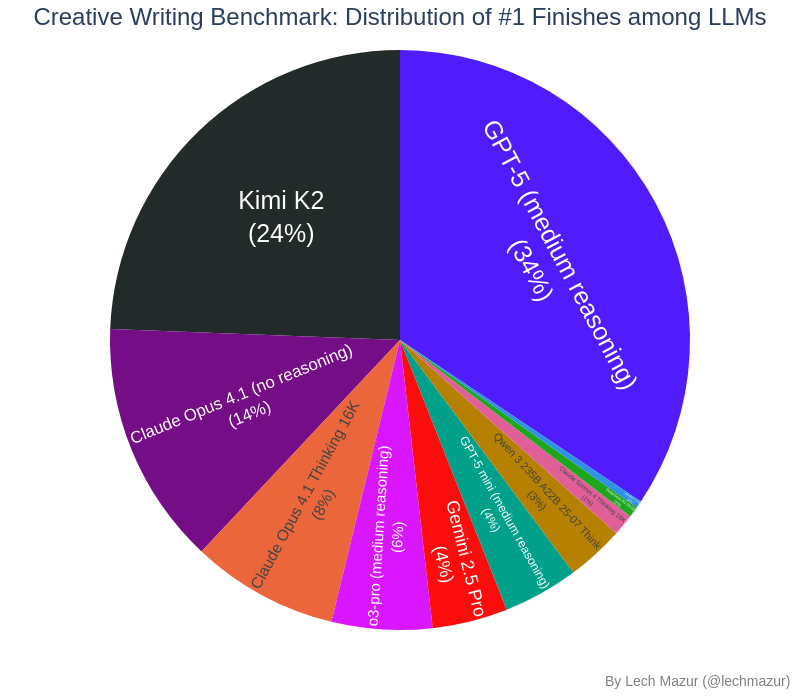
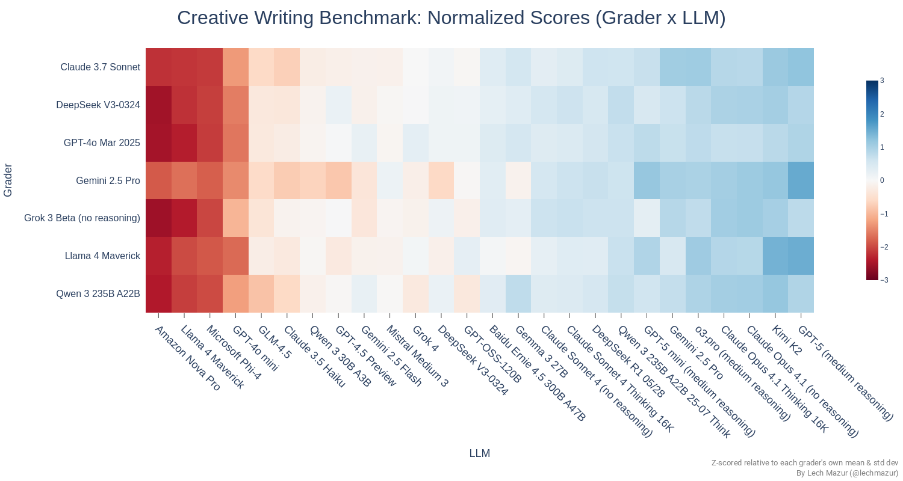
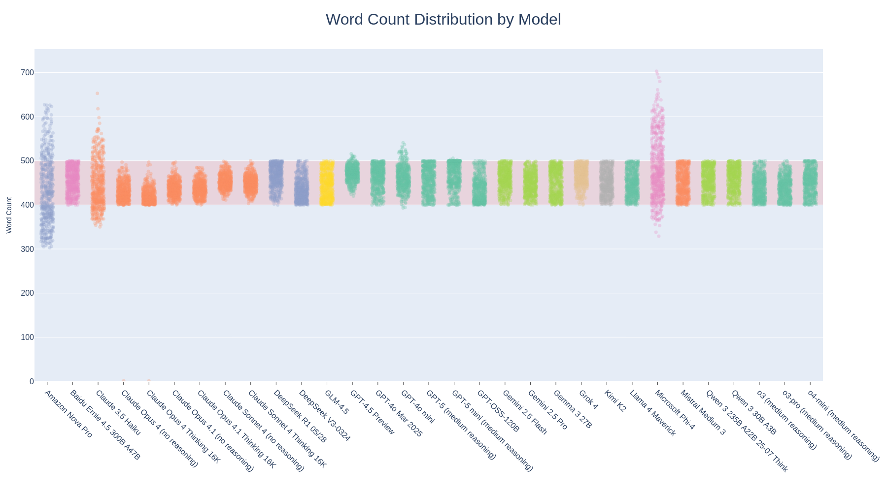
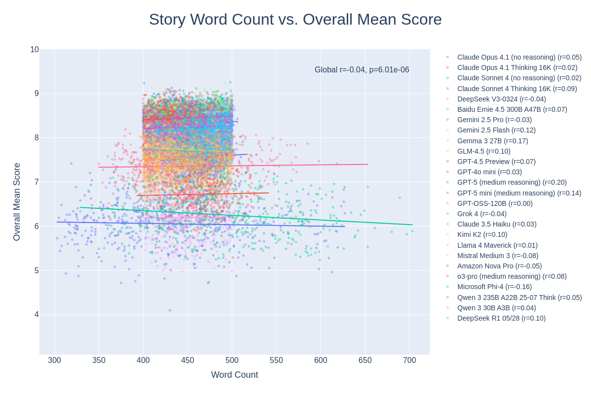
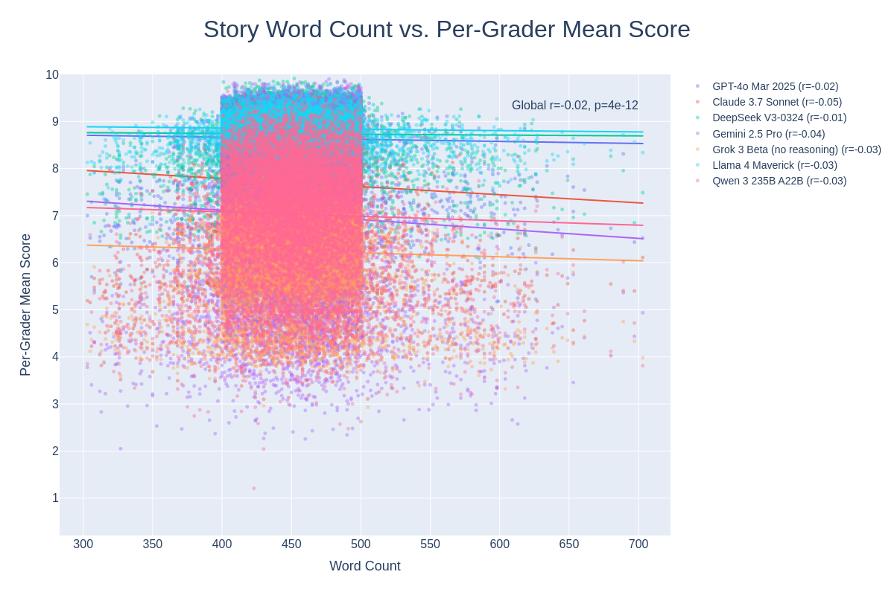
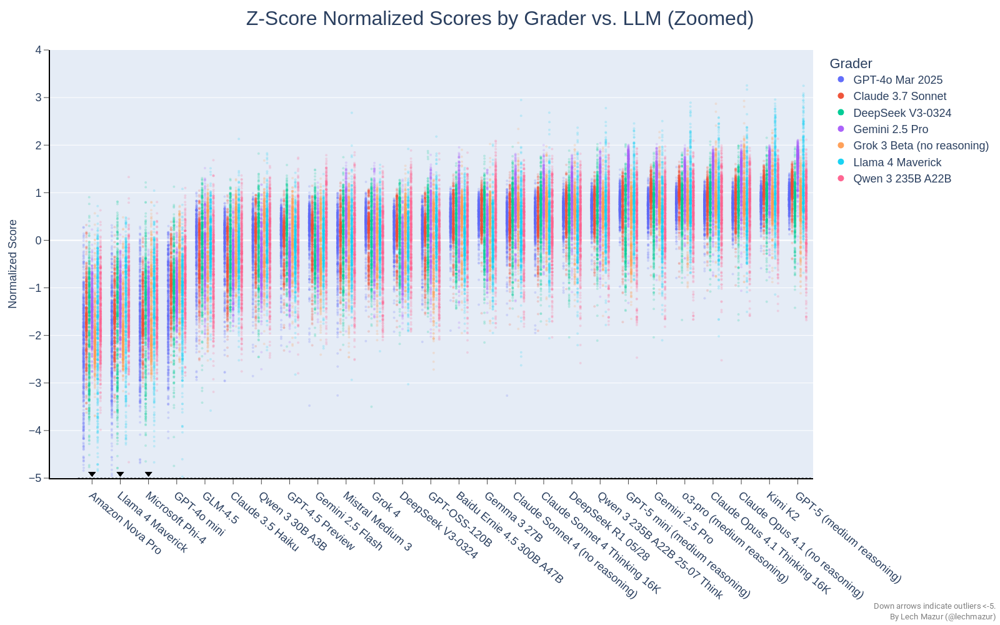
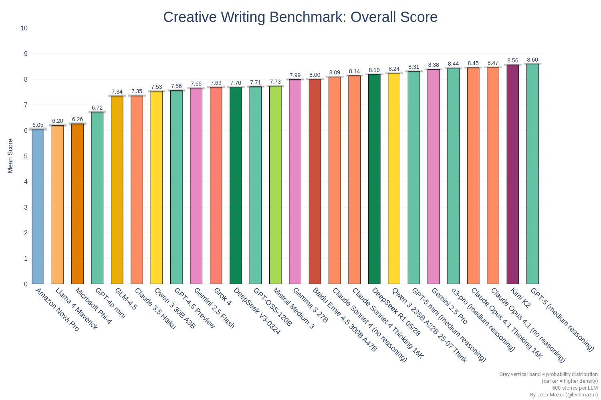

# LLM Creative Story‑Writing Benchmark V4

This benchmark evaluates how well large language models (LLMs) follow a creative brief while still producing engaging fiction. Every story must meaningfully incorporate ten **required elements**: character, object, concept, attribute, action, method, setting, timeframe, motivation, and tone. With these building blocks standardized and length tightly controlled, differences in **constraint satisfaction** and **literary quality** become directly comparable. Multiple independent “grader” LLMs score each story on an 18‑question rubric, and we aggregate those judgments into model‑level results.

---

---

## What’s measured

### 1) Craft and coherence (Q1–Q8)

Eight questions focus on narrative craft: character depth and motivation, plot structure and coherence, world building and atmosphere, story impact, originality, thematic cohesion, voice/point‑of‑view, and line‑level prose quality.

### 2) Element integration (Q9A–Q9J)

Ten questions check whether the story **organically** uses each required element: the specified character, object, core concept, attribute, action, method, setting, timeframe, motivation, and tone. If a category in the prompt is “None,” graders mark the corresponding 9‑series item as N/A.

### 3) Overall story score

We score each story per grader with a **60/40 weighted power mean (Hölder mean, p = 0.5)** over the 18 rubric items (Q1–Q8 = 60%, 9A–9J = 40%, split evenly within each group). Compared with a plain average, p = 0.5 acts like a soft‑minimum: it sits closer to the lowest dimensions, so weaknesses pull more than highs can offset and well‑rounded craft is rewarded. The final story score is the mean of the per‑grader scores.

---

## Results

### Overall model means

The top bar chart summarizes **mean story quality** for each model with uncertainty bands. (Grader‑unweighted means; questions weighted 60/40.)

#### Full overall leaderboard

| Rank | LLM                    | Mean Score | Samples | SEM |
|-----:|------------------------|-----------:|--------:|----:|
| 1 | GPT-5 Pro | 8.474 | 2797 | 0.0158 |
| 2 | GPT-5.1 (medium reasoning) | 8.438 | 2797 | 0.0134 |
| 3 | GPT-5 (medium reasoning) | 8.434 | 2797 | 0.0162 |
| 4 | Kimi K2-0905 | 8.331 | 2797 | 0.0199 |
| 5 | Gemini 3 Pro Preview | 8.221 | 2797 | 0.0170 |
| 6 | Gemini 2.5 Pro | 8.219 | 2797 | 0.0169 |
| 7 | Mistral Medium 3.1 | 8.201 | 2797 | 0.0185 |
| 8 | Claude Opus 4.5 (no reasoning) | 8.195 | 2797 | 0.0172 |
| 9 | Claude Sonnet 4.5 Thinking 16K | 8.169 | 2797 | 0.0176 |
| 10 | Claude Sonnet 4.5 (no reasoning) | 8.112 | 2797 | 0.0179 |
| 11 | Qwen 3 Max Preview | 8.090 | 2797 | 0.0233 |
| 12 | Claude Opus 4.1 (no reasoning) | 8.067 | 2797 | 0.0198 |
| 13 | Kimi K2 Thinking | 7.686 | 2797 | 0.0286 |
| 14 | Grok 4.1 Fast Reasoning | 7.566 | 2797 | 0.0297 |
| 15 | Baidu Ernie 4.5 300B A47B | 7.505 | 2797 | 0.0252 |
| 16 | GLM-4.6 | 7.452 | 2797 | 0.0285 |
| 17 | GLM-4.5 | 7.119 | 2797 | 0.0315 |
| 18 | GPT-OSS-120B | 7.030 | 2797 | 0.0336 |
| 19 | Cohere Command A | 6.794 | 2797 | 0.0302 |
| 20 | Llama 4 Maverick | 5.777 | 2797 | 0.0304 |

#### Full normalized leaderboard

| Rank | LLM                    | Normalized Mean |
|-----:|------------------------|-----------------:|
| 1 | GPT-5 Pro | 0.728 |
| 2 | GPT-5 (medium reasoning) | 0.691 |
| 3 | GPT-5.1 (medium reasoning) | 0.618 |
| 4 | Kimi K2-0905 | 0.614 |
| 5 | Gemini 3 Pro Preview | 0.441 |
| 6 | Gemini 2.5 Pro | 0.437 |
| 7 | Mistral Medium 3.1 | 0.435 |
| 8 | Qwen 3 Max Preview | 0.408 |
| 9 | Claude Opus 4.5 (no reasoning) | 0.403 |
| 10 | Claude Sonnet 4.5 Thinking 16K | 0.377 |
| 11 | Claude Sonnet 4.5 (no reasoning) | 0.302 |
| 12 | Claude Opus 4.1 (no reasoning) | 0.286 |
| 13 | Kimi K2 Thinking | -0.027 |
| 14 | Grok 4.1 Fast Reasoning | -0.129 |
| 15 | Baidu Ernie 4.5 300B A47B | -0.306 |
| 16 | GLM-4.6 | -0.312 |
| 17 | GLM-4.5 | -0.665 |
| 18 | GPT-OSS-120B | -0.734 |
| 19 | Cohere Command A | -1.113 |
| 20 | Llama 4 Maverick | -2.455 |

#### Element integration only (9A–9J)

A valid concern is whether LLM graders can accurately score questions 1 to 8 (Major Story Aspects), such as Character Development & Motivation. However, questions 9A to 9J (Element Integration) are clearly easier for graders to evaluate reliably. We observe high correlation between the per‑(grader, LLM) means for craft (Q1–Q8) and element‑fit (9A–9J), and a strong overall correlation aggregated across all files. While we cannot be certain these ratings are correct without human validation, their consistency suggests that something real is being measured. For an element‑only view, you can ignore Q1–Q8 and use only 9A–9J:

Normalized view (per‑grader z‑scores):

#### Craft only (Q1–Q8)

Normalized view (per‑grader z‑scores):

---

### LLM vs. Question (Detailed)

The detailed heatmap shows each model’s **mean score on each rubric question**. It is a fast way to spot models that excel at **voice and prose** but trail on **plot** or **element integration**, or vice versa.

---

### Which model “wins” the most prompts?

For every prompt, we rank models by their cross‑grader story score and tally the **number of #1 finishes**. This captures consistency at the very top rather than just the average.

---

### Grader ↔ LLM interactions

We publish two complementary views:

* **Mean heatmap (Grader × LLM).** Useful for seeing whether any model is especially favored or disfavored by a particular grader.

* **Normalized heatmap.** Z‑scores each grader’s scale so only **relative** preferences remain.

Additional view: grader–grader correlation (how graders align with each other).

---

## Method Summary 

**Stories and length.** Each model contributes short stories that must land in a **strict 600–800 word range**. We verify counts, flag outliers, and generate compliance charts before any grading. 

**Grading.** Each story is scored independently by **seven grader LLMs** using the 18‑question rubric above. 

**Aggregation.** For every story: compute the power mean (Hölder mean) with p = 0.5 across the 18 questions with a 60/40 per‑question weighting (Q1–Q8 vs. 9A–9J), then average across graders. For every model: average across its stories. We also compute **per‑question** means so readers can see where a model is strong (e.g., prose) or weak (e.g., plot or tone fit).

### Grading LLMs

The following grader models scored stories:

- Claude Sonnet 4.5 (no reasoning)
- DeepSeek V3.2 Exp
- Gemini 3 Pro Preview
- GPT-5.1 (low reasoning)
- Grok 4.1 Fast Reasoning
- Kimi K2-0905
- Qwen 3 Max

 
---

## How the ten required elements are chosen

We use a two‑stage LLM‑assisted pipeline that starts from large curated pools and converges on one coherent set per prompt:

 - The ten categories are defined in the elements catalog (character, object, core concept, attribute, action, method, setting, timeframe, motivation, tone).
- Seed prompts with candidates: For each seed index, we randomly sample ten options per category (plus the literal option “None”) from those pools and write a selection prompt.
- Proposer selection: Multiple proposer LLMs each pick exactly one element per category, allowing “None” in at most one category when that improves coherence. Each proposer returns a complete 10‑line set.
- Rate for fit: We deduplicate sets per seed and have several independent rater LLMs score how well each set “hangs together” (1–10). Scores are z‑normalized per rater to remove leniency differences and then averaged.
- Choose the winner: For each seed we take the top normalized‑mean set (ties are broken consistently). That set becomes the “required elements” block for the final story prompt.

Notes
- Within a prompt, categories never repeat; one category may be “None,” which means that element is not required for that prompt.
- There is no separate cross‑prompt coverage optimizer. Variety comes from the breadth of the curated pools and independent per‑seed sampling plus LLM selection and rating. As a result, duplicates across different prompts are possible but uncommon.

---

## Scoring scale 

- **Scale:** 0.0–10.0 per question, in 0.1 increments (e.g., 7.3).
- **Story score:** Power mean (Hölder mean) with p = 0.5 across the 18 questions with 60/40 per‑question weights (Q1–Q8 vs. 9A–9J), then averaged across graders.
- **Model score:** average of its story scores. Uncertainty bands reflect variation across prompts and sample size.

Coverage: each story is evaluated by seven independent LLM graders. Each prompt specifies one choice in each of ten categories; at most one category may be “None” (not required), keeping brief‑following comparable across models. If a category is “None,” graders mark that 9‑series sub‑question as N/A. N/As are excluded from aggregation and the per‑question weights are re‑normalized over the remaining questions.

---

## Robustness checks

- Exclude each model’s 50 lowest‑scoring stories: Rankings and means change only marginally; top models retain their order. We drop the 50 weakest stories per LLM (≈12.5% of each portfolio), recompute means, and compare ranks. 
- Leave‑one‑grader‑out: Recomputing means while excluding each grader in turn yields the same top tier; movements are within noise for most models. See per‑grader views and aggregates in the summary tables.

---

### Worst‑50 per‑LLM exclusion (top 15)

| LLM | Old Rank | Old Mean | New Rank | New Mean | ΔRank |
|-----|---------:|---------:|---------:|---------:|------:|
| GPT‑5 Pro | 1 | 8.443 | 1 | 8.515 | 0 |
| GPT‑5 (medium reasoning) | 2 | 8.398 | 2 | 8.467 | 0 |
| GPT‑5.1 (medium reasoning) | 3 | 8.380 | 3 | 8.451 | 0 |
| Kimi K2‑0905 | 4 | 8.312 | 4 | 8.408 | 0 |
| Gemini 3 Pro Preview | 5 | 8.206 | 5 | 8.271 | 0 |
| Gemini 2.5 Pro | 6 | 8.199 | 6 | 8.270 | 0 |
| Mistral Medium 3.1 | 7 | 8.171 | 7 | 8.240 | 0 |
| Claude Opus 4.5 (no reasoning) | 8 | 8.161 | 8 | 8.234 | 0 |
| Claude Sonnet 4.5 Thinking 16K | 9 | 8.143 | 9 | 8.226 | 0 |
| Qwen 3 Max Preview | 10 | 8.083 | 10 | 8.157 | 0 |
| Claude Sonnet 4.5 (no reasoning) | 11 | 8.079 | 11 | 8.156 | 0 |
| Claude Opus 4.1 (no reasoning) | 12 | 8.052 | 12 | 8.126 | 0 |
| Kimi K2 Thinking | 13 | 7.697 | 13 | 7.840 | 0 |
| Grok 4.1 Fast Reasoning | 14 | 7.610 | 14 | 7.696 | 0 |
| Baidu Ernie 4.5 300B A47B | 15 | 7.487 | 15 | 7.575 | 0 |

### Leave‑one‑grader‑out re‑rank (max change, top 15)

| LLM | Old Rank | Old Mean | Worst ΔRank | New Rank (worst) | New Mean (worst) | Removed grader |
|-----|---------:|---------:|------------:|------------------:|-----------------:|----------------|
| Qwen 3 Max Preview | 11 | 8.088 | -3 | 8 | 8.383 | Claude Sonnet 4.5 (no reasoning) |
| Gemini 2.5 Pro | 6 | 8.218 | 3 | 9 | 8.366 | Claude Sonnet 4.5 (no reasoning) |
| GPT‑5.1 (medium reasoning) | 2 | 8.437 | 2 | 4 | 8.603 | Claude Sonnet 4.5 (no reasoning) |
| Mistral Medium 3.1 | 7 | 8.199 | -2 | 5 | 8.433 | Claude Sonnet 4.5 (no reasoning) |
| Claude Opus 4.5 (no reasoning) | 8 | 8.194 | -2 | 6 | 8.177 | Kimi K2‑0905 |
| Gemini 3 Pro Preview | 5 | 8.219 | 2 | 7 | 8.176 | Kimi K2‑0905 |
| GPT‑5 (medium reasoning) | 3 | 8.433 | -1 | 2 | 8.626 | Claude Sonnet 4.5 (no reasoning) |
| GPT‑5 Pro | 1 | 8.473 | 1 | 2 | 8.476 | GPT‑5.1 (low reasoning) |
| Kimi K2‑0905 | 4 | 8.329 | -1 | 3 | 8.604 | Claude Sonnet 4.5 (no reasoning) |
| Claude Sonnet 4.5 Thinking 16K | 9 | 8.168 | 1 | 10 | 8.365 | Claude Sonnet 4.5 (no reasoning) |
| Claude Opus 4.1 (no reasoning) | 12 | 8.066 | -1 | 11 | 7.944 | DeepSeek V3.2 Exp |
| Claude Sonnet 4.5 (no reasoning) | 10 | 8.111 | 1 | 11 | 8.317 | Claude Sonnet 4.5 (no reasoning) |
| Baidu Ernie 4.5 300B A47B | 15 | 7.503 | -1 | 14 | 7.456 | Kimi K2‑0905 |
| Grok 4.1 Fast Reasoning | 14 | 7.564 | 1 | 15 | 7.454 | Kimi K2‑0905 |
| Kimi K2 Thinking | 13 | 7.684 | 0 | 13 | 7.980 | Claude Sonnet 4.5 (no reasoning) |

## Do Graders Agree?

We measure agreement three ways, then visualize the results with fixed, symmetric color ranges so “cool vs. warm” maps cleanly to lower vs. higher agreement:

1. **Story‑level overall.** Pairwise Pearson r (95% CI), Spearman ρ, and Lin’s concordance capture how similarly graders rank complete stories.
2. **Question‑level.** For each rubric question, we correlate graders across the shared set of stories and summarize agreement for craft questions (Q1–Q8) and element‑fit questions (9A–9J).
3. **Within‑story profile shape.** For each story we center each grader’s 18‑dimensional score vector (removing severity differences) and correlate the **shape** of judgments (“do graders like the same strengths and notice the same weaknesses?”).

Outputs include heatmaps and concise tables (e.g., “most disagreed‑upon stories,” coverage gaps). In practice, graders show **solid, repeatable alignment** on both story‑level and question‑level judgments, and profile‑shape agreement helps reveal where differences come from (e.g., one grader reacting more to tone than plot).

**Figures:**

---

## Best and Worst Stories

We highlight **standout individual stories** (highest cross‑grader means) and a short list of **lowest‑rated** pieces, with direct links and the ten **required elements** under each entry. This lets you compare top work side‑by‑side with weak outcomes and see how the elements were interpreted. Refusals to incorporate a required element remain visible here and typically land near the bottom.

- Data: The dataset includes story‑level winners/laggards with links and grader‑range diagnostics.
- Comments: Per‑question grader comments are collated under `comments_by_llm_1to8/`.
- Summaries: per‑story and per‑LLM summaries live under `summaries/` and `general_summaries/`.

### Examples (Top 3 / Bottom 3)

Top 3 individual stories (all graders):

* **Story**: [story_wc_186.txt](stories_wc/gpt-5.1-medium/story_wc_186.txt) by GPT‑5.1 (medium reasoning)
  - Overall Mean (All Graders): 9.09
  - Grader Score Range: 8.37 (lowest: Claude Sonnet 4.5 (no reasoning)) .. 9.50 (highest: DeepSeek V3.2 Exp)
  - Required Elements:
    - Character: beacon-tower custodian
    - Object: broken crystal prism
    - Core Concept: a shard of hush
    - Attribute: retrocognitively blessed
    - Action: rekindle
    - Method: by tracking star paths
    - Setting: glass humming pavilion
    - Timeframe: after the collapse of civilization
    - Motivation: to prove that coincidences have meaning
    - Tone: thistle-blown hope

* **Story**: [story_wc_13.txt](stories_wc/gpt-5-medium/story_wc_13.txt) by GPT‑5 (medium reasoning)
  - Overall Mean (All Graders): 9.06
  - Grader Score Range: 8.38 (lowest: Claude Sonnet 4.5 (no reasoning)) .. 9.46 (highest: Gemini 3 Pro Preview)
  - Required Elements:
    - Character: natural history illustrator
    - Object: infinity symbol pendant
    - Core Concept: interrupted cadence
    - Attribute: sculpts time itself
    - Action: uncage
    - Method: by borrowing time
    - Setting: rooftop canal system weaving between towers
    - Timeframe: across a giant's nap
    - Motivation: to find the place where echoes are born
    - Tone: None (category left open for this prompt)

* **Story**: [story_wc_347.txt](stories_wc/gpt-5-pro/story_wc_347.txt) by GPT‑5 Pro
  - Overall Mean (All Graders): 9.05
  - Grader Score Range: 8.45 (lowest: Claude Sonnet 4.5 (no reasoning)) .. 9.31 (highest: Gemini 3 Pro Preview)
  - Required Elements:
    - Character: reluctant caretaker of a cursed orchard
    - Object: small nut
    - Core Concept: forgotten blueprint
    - Attribute: offhandedly exact
    - Action: assemble
    - Method: leaving impressions without touching
    - Setting: cliffside labyrinth patrolled by mechanical birds
    - Timeframe: before the night frost forms
    - Motivation: to guide lost travelers to safety
    - Tone: graceless beauty

Bottom 3 individual stories (all graders):

* **Story**: [story_wc_119.txt](stories_wc/llama4-maverick/story_wc_119.txt) by Llama 4 Maverick
  - Overall Mean (All Graders): 3.91
  - Grader Score Range: 2.38 (lowest: Kimi K2‑0905) .. 5.96 (highest: DeepSeek V3.2 Exp)
  - Required Elements:
    - Character: cryptic fortune cookie writer
    - Object: spycraft microdot film specs
    - Core Concept: open secrets
    - Attribute: accidentally prophetic
    - Action: orchestrate
    - Method: by directing flow
    - Setting: mysterious lighthouse on a rocky island
    - Timeframe: after last orders
    - Motivation: to transpose life into a new key
    - Tone: familiar enigma

* **Story**: [story_wc_4.txt](stories_wc/llama4-maverick/story_wc_4.txt) by Llama 4 Maverick
  - Overall Mean (All Graders): 4.45
  - Grader Score Range: 3.21 (lowest: Gemini 3 Pro Preview) .. 5.63 (highest: Kimi K2‑0905)
  - Required Elements:
    - Character: subtle puzzle archivist
    - Object: dove gray map case
    - Core Concept: collective healing
    - Attribute: perceptively calm
    - Action: linger
    - Method: via arcs in black-and-white photographs
    - Setting: lavender field tucked behind rusted factory ruins
    - Timeframe: as vines climb
    - Motivation: to transmute pain into a masterpiece
    - Tone: earnest whimsy

* **Story**: [story_wc_389.txt](stories_wc/llama4-maverick/story_wc_389.txt) by Llama 4 Maverick
  - Overall Mean (All Graders): 4.46
  - Grader Score Range: 2.53 (lowest: Gemini 3 Pro Preview) .. 7.98 (highest: DeepSeek V3.2 Exp)
  - Required Elements:
    - Character: lonely visionary
    - Object: cobalt glass portico
    - Core Concept: variant allegiance
    - Attribute: lyrically prophetic
    - Action: unfold
    - Method: through fragmented radio frequencies
    - Setting: stormlit observatory above clouds
    - Timeframe: across the rise of a prophet
    - Motivation: to shape a new dawn using ancient shadows
    - Tone: gritty whimsy

---

## Head‑to‑Head Comparisons

We include A‑vs‑B analyses for stories written to the same required elements, separating rubric‑aligned differences (Q1–Q8 craft; 9A–9J element fit) from beyond‑rubric observations (e.g., risk appetite, cultural specificity).

Head‑to‑head summaries are provided in `inter_llm_comparison_summaries/` (where available).

---

## Example writer summaries

Short excerpts from model‑level writer summaries (see `general_summaries/` for full text):

### GPT‑5 (medium reasoning)

1) Executive profile

Across the eight craft questions this model stays in Track A: a single, disciplined POV, accumulative structures, and pressure that tightens through micro‑choices instead of twisty plotting. The dominant impression is immersive interiority—motivation rendered as tactile actions—anchored inside settings that behave like constraints rather than backdrops, so closure usually feels earned and priced.

Strengths cluster around clarity of lens and on‑page cost: stakes are flagged early, escalated through specific trade‑offs, and settled with a concrete reconfiguration rather than a free‑floating epiphany. When it stumbles, the prose can over‑lyricize at peak beats, flattening visceral struggle into conceptual statements, or escalate pressure in atmosphere instead of a visible crucible.

Signature moves (sample):
- Translating abstract desire into precise micro‑actions (“pressing the heart fragment to my rib”) so every beat shows a value exchange.
- Running contradictory impulses concurrently in-scene—shame vs. clarity, fear vs. need—and forcing a single choice that visibly forecloses a path.
- Letting objects and environments act as puzzles to solve, so motif systems and setting mechanics drive both theme and closure.

### Kimi K2‑0905

1) Executive profile

Kimi K2‑0905’s fiction reads as high‑literary, accumulative, and relentlessly character‑bound. It favors a close POV in compact timespans, teaching motifs early and then reweighting them at closure so even complex mosaics hold together. Motivation, stakes, setting, and ingenuity all flow through tactile, POV-biased particulars, which is why the work often feels publishable as-is.

Limitations surface when lyricism outruns pressure: peak beats sometimes swap embodied conflict for abstraction or therapy‑speak, mid‑story patterning can drift into atmosphere, and a few endings fall back to familiar emotional arcs instead of pushing the premise to its sharpest cost. Even then the underlying control remains strong; the fix is usually tightening escalation and trimming overgrowth rather than reinventing structure.

Signature moves (sample):
- Rendering interiority through sensory labor—emotions shown as “sorting tape fragments” or “breath fogging glass” instead of named states.
- Holding contradictions in the same beat (“catalog vs. destroy”) so crises feel psychologically pressurized and agentive.
- Treating objects and settings as constraint engines: bells, shards, valves, or obsidian shards recur as living problems whose motif payoff delivers closure.

## Word count and length effects

Length is part of the test design. Tight control limits “padding” advantages and keeps attention on **writing quality** and **element integration**.

* **Compliance dashboard.** We show a per‑model strip plot of story lengths, an overall histogram, and per‑model averages with **95% confidence intervals**, plus lists of outliers (too short/long). Use these to check that models aren’t gaining from padding or being penalized for minor over‑runs.
* **Correlation checks.** We also examine whether length correlates with score overall and by grader.

 

---

## Normalized (z‑scored) perspective

Because graders use slightly different scales, we also show a **normalized view** where each grader’s scores are z‑scored before aggregation. This helps confirm that top models remain strong even after “leniency” differences are removed. The normalized **Grader × LLM** heatmap on this page uses that approach.

### Normalized distributions

### Normalized leaderboard

---

## Ablation: Q1–Q8 vs 9A–9J

Correlation between craft (Q1–Q8) and element fit (9A–9J) is high across graders and models.

- Overall correlation: 0.836 (N = 47,600) — from `data/question_range_correlation.csv` (overall row).
- Per‑grader × model correlations are included in the correlation report.
- Complementary element‑only view: 

---

## What’s new in V3

* **All new graders**

## What’s new in V3

* **Required elements pipeline:** moved from fewer, randomly selected elements (no "None" allowed) to a curated, ten‑category catalog with large, diverse pools and an LLM proposer→rater selection process; at most one category may be explicitly set to **None** when that improves coherence.
* **Rubric expansion:** grew from 7 craft items to an **18‑question rubric** (8 craft + 10 element‑fit), with clearer, more granular definitions; Q7 and Q8 now separate voice/POV from prose quality.
* **Story length:** increased from 400–500 words to a strict **600–800** window with upfront enforcement and compliance dashboards. Enforcement is applied at prompt level and in pre‑grading extraction, with compliance dashboards and optional cleanup tools; it is not a hard inclusion gate during aggregation unless you apply the cleanup step.
* **Aggregation change:** replaced simple averages with a **power mean (Hölder mean, p = 0.5)** and 60/40 weighting (Q1–Q8 vs. 9A–9J) to reward balanced performance and penalize weak dimensions more.
* **Grader refresh:** upgraded the grader set—previously: Claude Opus 4.1 (no reasoning), DeepSeek V3.1 Reasoner, Gemini 2.5 Pro, GPT‑5 (low reasoning), Grok 4, Kimi K2, Qwen 3 235B A22B 25‑07 Think; now: Claude Sonnet 4.5 (no reasoning), DeepSeek V3.2 Exp, Gemini 3 Pro Preview, GPT‑5.1 (low reasoning), Grok 4.1 Fast Reasoning, Kimi K2‑0905, Qwen 3 Max.
* **Model set additions:** added Kimi K2‑0905, Qwen 3 Max Preview, Mistral Medium 3.1, Claude Opus 4.1 (no reasoning), DeepSeek V3.1 Reasoner, and DeepSeek V3.1 Non‑Think to the evaluated models.
* **New analyses:** added head‑to‑head A‑vs‑B comparisons, model‑level style summaries, and intra‑model style diversity analysis (previously none).
* **Agreement views:** expanded beyond only grader‑grader correlations to include Grader×LLM mean and normalized matrices, story‑level disagreement tables, and leave‑one‑grader‑out robustness checks.
* **Optional grader weighting:** available for users who prefer grader‑reliability‑weighted summaries.

---

## Limitations

* This quality benchmark grades stories **individually**. Collection‑level style diversity is analyzed separately in the companion study “Mapping LLM Style and Range in Flash Fiction.” See the link below for within‑model range results.
* LLM graders are consistent, but they remain automated judges. We publish multiple views (overall means, question breakdowns, #1 finishes, agreement checks) to keep interpretations grounded.
* Hard length limits test precise compliance, which is useful here, but they are not a claim about ideal length for fiction.

---
## Details
Full range of scores:

---

## Related work

If you want a deeper look at **style and diversity** (stylometry, cluster maps, and within‑model diversity scored as a collection), see the companion study: **[https://github.com/lechmazur/writing\_styles](https://github.com/lechmazur/writing_styles)**.

---

## Archive (Previous Version)

For the prior editions’ full leaderboards and the list of “old” grader LLMs, see: [v3/README.md](v3/README.md) and [v2/README.md](v2/README.md).

## Other multi-agent benchmarks
- [PACT - Benchmarking LLM negotiation skill in multi-round buyer-seller bargaining](https://github.com/lechmazur/pact)
- [BAZAAR - Evaluating LLMs in Economic Decision-Making within a Competitive Simulated Market](https://github.com/lechmazur/bazaar)
- [Public Goods Game (PGG) Benchmark: Contribute & Punish](https://github.com/lechmazur/pgg_bench/)
- [Elimination Game: Social Reasoning and Deception in Multi-Agent LLMs](https://github.com/lechmazur/elimination_game/)
- [Step Race: Collaboration vs. Misdirection Under Pressure](https://github.com/lechmazur/step_game/)

## Other benchmarks
- [LLM Round‑Trip Translation Benchmark](https://github.com/lechmazur/translation/)
- [Extended NYT Connections](https://github.com/lechmazur/nyt-connections/)
- [LLM Thematic Generalization Benchmark](https://github.com/lechmazur/generalization/)
- [LLM Confabulation/Hallucination Benchmark](https://github.com/lechmazur/confabulations/)
- [LLM Deceptiveness and Gullibility](https://github.com/lechmazur/deception/)
- [LLM Divergent Thinking Creativity Benchmark](https://github.com/lechmazur/divergent/)
---

## Updates 
- Nov 25, 2025: Major new version of the benchmark: V4. All new graders. GPT-5 Pro, Gemini 3 Pro, GPT-5.1, Claude Opus 4.5, Claude Sonnet 4.5, Grok 4.1, Kimi K2 Thinking, GLM-4.6 added.
- Sep 23, 2025: Grok 4 Fast Reasoning added.
- Sep 9, 2025: Major new version of the benchmark: V3. See the section "What’s new in V3"

- Follow [@lechmazur](https://x.com/LechMazur) on X for other upcoming benchmarks and more.
